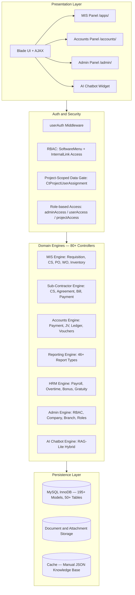
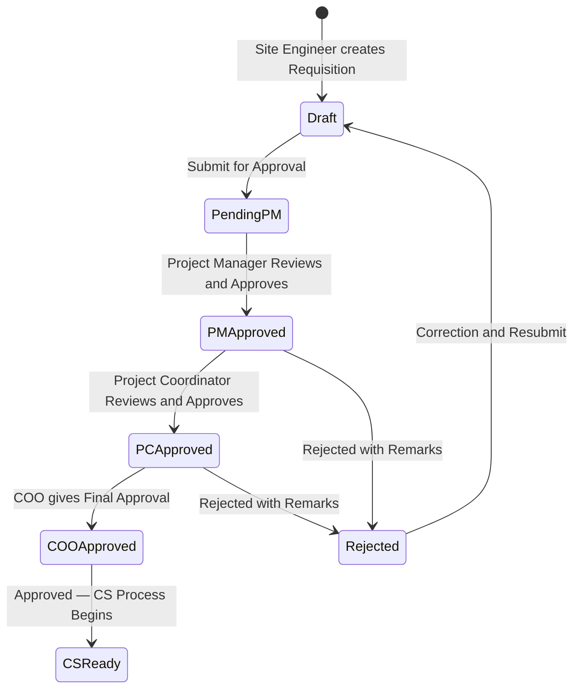
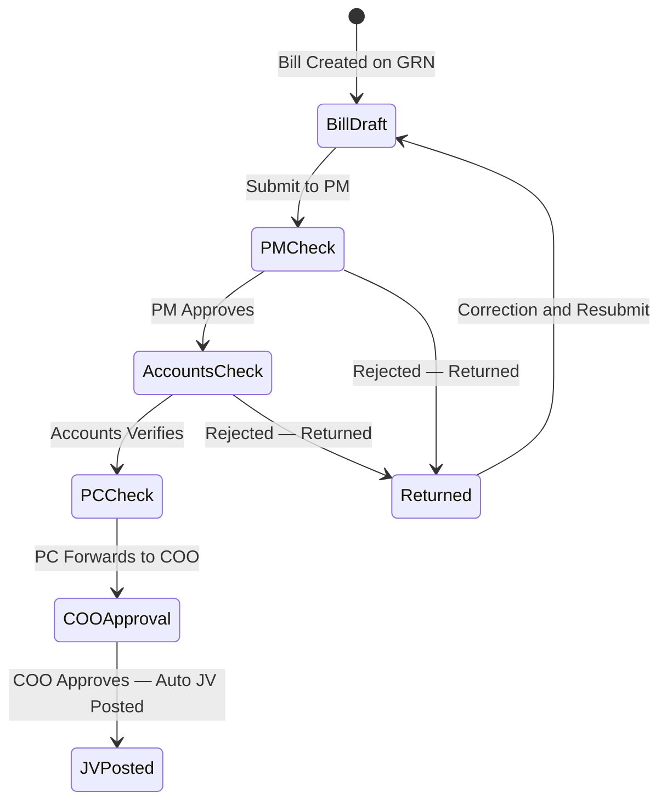
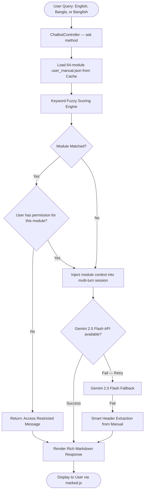

# 🏗️ Enterprise Construction MIS — Procurement, Sub-Contractor & Multi-Tier Approval Platform

[](https://laravel.com)
[](https://www.php.net/)
[](https://www.mysql.com/)
[]()
[]()
[]()

> 🔒 **Confidentiality Notice:** This is an anonymized technical case study of a production enterprise Construction MIS built for a real estate & civil engineering organization. Client names, credentials, production database seeds, and private API hostnames have been removed per NDA.

---

## 📑 Table of Contents

1. [Business Context & Problem Statement](#-1-business-context--problem-statement)
2. [Platform Modules Overview](#-2-platform-modules-overview)
3. [System Architecture](#-3-system-architecture)
4. [MIS Module — The Core Procurement Engine](#-4-mis-module--the-core-procurement-engine)
5. [Accounts Module — Financial Operations](#-5-accounts-module--financial-operations)
6. [HRM Module — Human Resources Management](#-6-hrm-module--human-resources-management)
7. [Admin Module — System Configuration & Access Control](#-7-admin-module--system-configuration--access-control)
8. [Database Design & FIFO Stock Engine](#-8-database-design--fifo-stock-engine)
9. [AI-Powered Hybrid ERP Chatbot](#-9-ai-powered-hybrid-erp-chatbot)
10. [Key Engineering Challenges & Solutions](#-10-key-engineering-challenges--solutions)
11. [Tech Stack](#-11-tech-stack)
12. [Impact & Metrics](#-12-impact--metrics)

---

## 📌 1. Business Context & Problem Statement

A construction and real estate company managing multiple active projects across different geographic branches needed to replace fragmented, paper-based processes with a centralized digital platform. Key pain points:

| Pain Point | Impact |
|---|---|
| Manual Requisition → PO → WO handoffs | Weeks of delays per procurement cycle |
| No real-time budget-vs-spend tracking | BOQ overruns going undetected |
| Paper-based sub-contractor billing | Retention & advance ledgers miscalculated |
| No cross-site inventory visibility | Material double-ordering & stock wastage |
| No audit trail for financial disbursements | Compliance & fraud risk |
| Manual salary & overtime calculation | HR errors and disputes |

**The solution:** A full-stack enterprise ERP with **4 major modules** — MIS (Construction Management), Accounts, HRM, and Admin — covering the entire project lifecycle from BOQ budgeting through to financial reporting.

---

## 🏢 2. Platform Modules Overview

```
┌──────────────────────────────────────────────────────┐
│              Construction ERP Platform               │
├──────────────┬──────────────┬──────────┬─────────────┤
│  MIS Module  │   Accounts   │   HRM    │    Admin    │
│  /apps/      │  /accounts/  │  /apps/  │  /admin/   │
├──────────────┼──────────────┼──────────┼─────────────┤
│ Procurement  │ Payments     │ Employee │ User RBAC   │
│ BOQ/CS/PO/WO │ JV Vouchers  │ Salary   │ Menu Config │
│ Inventory    │ Ledgers      │ Overtime │ Role Mgmt   │
│ Sub-contract │ Fin. Reports │ Bonus    │ Company     │
│ Project Mgmt │ Trial Balance│ Gratuity │ Branch      │
└──────────────┴──────────────┴──────────┴─────────────┘
```

---

## 🏛️ 3. System Architecture



---

## 🔧 4. MIS Module — The Core Procurement Engine

The MIS module drives the entire construction procurement and project management lifecycle.

### 4.1 BOQ (Bill of Quantities) & Budget Management

- Granular item-level quantity estimation and rate setup per project
- BOQ Summary generation with attachment support
- Real-time deviation tracking: allocated BOQ vs. cumulative purchase orders

### 4.2 Material Requisition — 5-Stage Approval Workflow

Every material requisition follows a strict, role-enforced approval chain:



| Status Code | Stage | Role |
|---|---|---|
| `0` | Draft | Site Engineer |
| `1` | Submitted | Pending PM Review |
| `2` | PM Approved | Awaiting PC Review |
| `3` | PC / Engineer Approved | CS Assigned, Supplier Selected |
| `4` | COO Final Approval | Procurement Cleared |

### 4.3 Comparative Statement (CS) Engine

After PM approval, the procurement team conducts competitive vendor evaluation:

- **Material CS (`ComparativeStatementController`):** Multi-supplier price comparison per item. Evaluates unit price, payment terms, and delivery schedules.
- **Sub-Contractor CS (`SubContractorContractCSController`):** Task-rate comparison across civil/labour contractors. Each CS line item records individual supplier quotes.
- **CS Approval Flow:** CS goes through a dedicated vetting/check stage (`ScContractCsCheck`) before a supplier is confirmed.
- **Reversal Support:** A CS can be reversed with an audit remark stored in `ScContractCsCheck` (`remarks LIKE 'REVERSED:%'`).

### 4.4 Purchase Order (PO) & Work Order (WO) Lifecycle

After CS approval, a PO/WO is generated:

- `purchase_order_master` stores both material POs and Work Orders (`is_non_cs` flag distinguishes direct vs. CS-based)
- Each WO tracks: supplier, advance amount, order date, and item-level details

**Work Order Approval (3-Stage):**

| `approved_status` | Meaning |
|---|---|
| `0` | Pending WO Approval |
| `1` | WO Approved |
| `2` | WO Rejected / Sent Back |

**On WO Approval — Automatic Actions (single `DB::transaction`):**
1. Update `requisition_master`: `wo_approval_status`, approver, timestamp
2. Update `purchase_order_master`: `approved_status`, `approved_by`, `approved_date`
3. Create immutable `WorkOrderApprovalLog` entry
4. If `advance_amount > 0`: Auto-generate `BillCreate` (Supplier Advance) record
5. Auto-generate `IndentInfo` for the payment pipeline

**On WO Rejection — Full Cascade Reset:**
```php
DB::table('requisition_details')->update([
    'purchase_cs_status' => 0,
    'purchase_create' => 0,
    'purchase_cs_supplier_id' => null,
    'purchase_cs_price' => null,
    'is_non_cs' => 0
]);
// + IndentInfo approve_status reset to 2 (Reversed)
```

### 4.5 Purchase Receive (GRN — Goods Receipt Note)

`ProPurchaseReceiveController` (53KB — the largest controller):
- Receive materials against approved POs
- Records batch-level quantity and unit cost into `StockFifo`
- Supports partial deliveries and multi-batch receives
- Triggers stock ledger updates and links to `PurchaseMaster`

### 4.6 Bill Vetting & CEO/COO Final Bill Approval

After goods receive, supplier bills go through a 5-stage financial vetting pipeline:



| `billstatus` | Stage |
|---|---|
| `1` | Bill Initiated |
| `2` | PM Approved — Forwarded to Accounts |
| `3` | Accounts Checked — Forwarded to COO |
| `4` | Sub-Contractor Bill Stage |

**On COO/CEO Approval — Automatic Double-Entry JV Posting:**

For Material Bills (`bill_for = 1`):
```
DR  WIP Material Account   →  per-category purchase total   (wip_material config)
CR  A/P Supplier Account   →  grand total                   (acc_payable_supplier config)
+ Creates PurchaseMaster (SPB type) + PurchaseLedger entry
```

For Sub-Contractor Bills (`bill_for = 2`):
```
DR  WIP Contractor Account →  bill amount   (wip_contractor config)
CR  A/P Contractor Account →  bill amount   (acc_payable_contractor config)
+ Creates SubContractorBillLeadger (ledger_type = 1: Bill)
```

**Contract Overrun Guard:**
```php
$due_bill = $total_agreement_value - SUM(previously_approved_bills);
if ($new_bill_amount > $due_bill) {
    return response()->json(['message' => 'Bill exceeds remaining contract value'], 422);
}
```

### 4.7 Sub-Contractor Full Lifecycle

A dedicated sub-flow for specialized civil and labour contractors:

```
Sub-Contractor Registration
    └── Sub-Contractor CS (Quote Comparison)
            └── Agreement Creation (WBS + Retention %)
                    ├── Running Bill Submission (ct_contractor_bill)
                    │       └── Bill Approval → JV Posting
                    ├── Advance Payment (sub_contractor_bill_leadger, ledger_type = 3)
                    └── Final Payment with Retention Release
```

- **Agreement Controller** (`SubContractorAgreementController`, 1005 lines): Manages WBS-based contracts, retention money rules, and advance recovery schedules.
- **Running Bill Controller** (`SubContractorBillController`): Generates running bills, deducts mobilization advance amortization and retention holdbacks automatically.
- **Payment Controller** (`SubContractorContractPriceController`): Handles milestone-based final payments.

### 4.8 Material Consumption

`ProductConsumptionController` — Tracks how materials are consumed on site:

- Records consumption per project, per PO, per product
- Deducts from FIFO stock batches (oldest batch first)
- Generates `ConsumptionMaster` + `ConsumptionDetails` records
- Cross-references against `StockLedger` and `StockLedgerSummary`
- Stores consumption history in `StockLedgerHistoryMaster` + `StockLedgerHistoryDetails`

### 4.9 Inter-Project Stock Transfer

`StockTransferController` — Transfers materials between construction sites:

- Source project releases from its FIFO stock (outward `StockFifo` deduction)
- Destination project receives into its FIFO stock (inward `StockFifo` creation)
- Transfer verified and confirmed by receiving site
- Full audit trail with dispatch and receiving records

### 4.10 MIS Reports (31 Report Types)

| Report | Controller |
|---|---|
| Order Sheet (Project-wise procurement summary) | `OrderSheetReportController` |
| Purchase Report (by supplier, date, product) | `PurchaseReportController` |
| Raw Material Purchase Report | `RawMaterialPurchaseReportController` |
| Inventory Hand Upto Date | `InventoryHandUptoDateController` |
| Inventory Report | `InventoryReportController` |
| Stock Movement by Product | `StockMovementProductController` |
| Stock Movement by Product Group | `StockMovementProGroupController` |
| Stock Receiving Report | `StockReceivingReportController` |
| Stock Summary Report | `StockSummeryReportController` |
| Stock Details Report | `StockDetailsReportController` |
| Stock Products History Report | `StockProductsHistoryReportController` |
| Stock Transfer Report | `stockTransferringReportController` |
| Consumption List Report | `ConsumptionListReportController` |
| Project Details Report | `ProjectDetailsReportController` |
| Project Income vs Expense Report | `ProjectIncomeExpenseReportController` |
| Project Estimation Report | `ProjectEstimationController` |
| Due Collection Report | `DueCollectionReportController` |
| Contractor Bill Report | `ContractorBillReportController` |
| Contractor Payment Report | `ContractorPaymentReportController` |
| Supplier Bill Report | `SupplierBillReportController` |
| Supplier Payment Report | `SupplierPaymentReportController` |
| Invoice Report | `InvoiceReportController` |
| Sales Reports (Customer-wise, Month-wise) | `SalesReportController`, `SalesListCustomerWiseReportController` |
| Purchase Advance Report | `MyPurchaseAdvanceReportController` |

---

## 💰 5. Accounts Module — Financial Operations

The Accounts module (`/accounts/` prefix, EW namespace) manages all financial transactions, payments, ledgers, and statutory financial reports.

### 5.1 Voucher Management

| Voucher Type | Controller |
|---|---|
| Payment Voucher (Cash) | `PaymentVoucherController` |
| Received Voucher (Cash) | `ReceivedVoucherController` |
| Bank Payment Voucher | `BankPaymentVoucherController` |
| Bank Received Voucher | `BankReceivedVoucherController` |
| Journal Voucher (General) | `JournalVoucherController` |
| Journal Voucher (Employee) | `JournalVoucherEMController` |
| Journal Voucher (Sub-Contractor) | `JournalVoucherSCController` |
| Journal Voucher (CMR) | `JournalVoucherCMRController` |
| Journal Voucher (Bill) | `JournalVoucherBillController` |

### 5.2 Payment Processing

| Payment Type | Controller |
|---|---|
| Supplier Payment (Post-bill clearance) | `SupplierPaymentController` |
| Supplier Advance Payment | `SupplierAdvancePaymentController` |
| Purchase Payment (Direct) | `PurchasePaymentController` |
| Sub-Contractor Payment | `SubContractorPaymentController` |
| Sub-Contractor Advance | `SubContractorAdvanceController` |
| Employee Advance Request | `AdvanceForRequestController` |
| Project Advance | `ProjectAdvanceController` |
| Project Due Collection | `ProjectDueCollectionController` |

### 5.3 WIP to Expense Conversion

When a project milestone is completed, WIP (Work-in-Progress) asset accounts are converted to expense accounts:

- `AccountWIPConfigurationController`: Maps project PO categories to WIP account codes
- `AccountWIPToExpenseController`: Transfers WIP balance to operational expense — creates balancing JV entries automatically

### 5.4 Financial Reports (15 Report Types)

| Report | Controller |
|---|---|
| Trial Balance | `TrialBalanceController` |
| Balance Sheet | `BalanceSheetController` |
| Receipts & Payments | `ReceiptsPaymentsController` |
| Ledger Query (General) | `LedgerQueryController` |
| Ledger Query (3rd Party) | `LedgerQuery3rdController` |
| Cash Book | `CashBookController` |
| Bank Book | `BankBookController` |
| Accounts Payable | `AccountsPayableController` |
| Accounts Receivable | `AccountsReceivableController` |
| Supplier Statement | `SupplierStatementController` |
| Contractor Statement | `ContractorStatementController` |
| Customer Statement | `CustomerStatementController` |
| Employee Purchase Advance Statement | `EmployeePurchaseAdvanceStatementController` |
| Collectable Income / Expense | `CollectableIncomeController` / `CollectableExpenseController` |
| Voucher Print | `PrintVoucherController` |

### 5.5 Purchase Indent (Accounts-side approval)

`PurchaseIndentController` in the Accounts module manages the **post-approval payment posting** for indented items — validating that approved bills get properly indented before any payment processing begins.

---

## 👥 6. HRM Module — Human Resources Management

The HRM module (`HRM` namespace) handles the complete employee lifecycle from hiring to payroll.

### 6.1 Employee Management
- `EmployeeBasicInfoController`: Employee profiles with department, designation, branch, and user assignments
- `DesignationController` / `DepartmentController`: Organizational structure management

### 6.2 Payroll Engine
`MonthlySalaryConfigController` — Automated monthly payroll calculation:
- Basic salary, house rent, medical, and allowance components
- Advance deductions and loan recovery scheduling
- Monthly payment ledger generation (`MonthlyConfigPaymentLeadger`)
- Advance details tracking (`MonthlyConfigAdvanceDetails`)

### 6.3 Overtime Management
- `OvertimeController` / `NewOverTimeController`: Records daily overtime hours, calculates overtime pay at configured rates
- Integrates with monthly salary processing

### 6.4 Bonus, Incentive & Gratuity
- `BonusController`: Festival/performance bonus disbursement with per-employee allocation
- `IncentiveController`: Target-based incentive tracking
- `GratuityController`: End-of-service gratuity calculation based on service tenure

### 6.5 HRM Reports
- `MonthlySalaryConfigReportController`: Month-wise payroll summary and individual payslips

---

## ⚙️ 7. Admin Module — System Configuration & Access Control

The Admin module (`/admin/` prefix) is the central control plane for the entire platform.

### 7.1 User & Employee Management
- **User accounts**: Create, assign project access, set login credentials, manage session state
- **Role management** (`employeeRoll`): Define named roles with bundled permissions
- **Role-based access**: `EmployeeRollAccessController` assigns predefined permission bundles to users

### 7.2 Dynamic RBAC (3-Layer Authorization)

```
Layer 1 — Authentication Guard
    ├── userAuth guard   → MIS and Accounts panels
    └── adminAuth guard  → Software Admin panel

Layer 2 — Menu and Module Access
    ├── SoftwareModules (top-level module visibility)
    ├── SoftwareMenu (sidebar menu items)
    ├── SoftwareInternalLink (individual CRUD actions)
    └── Middleware: userAccess checks every request

Layer 3 — Data Scoping
    └── CtProjectUserAssignment
        → Non-admin users see ONLY their assigned projects
        → Prevents horizontal privilege escalation across branches
```

### 7.3 Organization Setup
- **Branch Management** (`BranchController`): Geographic branch configuration
- **Area Management** (`AreaController`): Sub-branch area definitions
- **Company Profile** (`CompanyProfileController`): Logo, address, fiscal settings
- **Salary Configuration** (`CompanySalaryConfigController`): Global payroll rules (pay scale, allowance %)
- **Currency Setup** (`CurrencySetupController`): Multi-currency support with default currency per project
- **Dashboard Access Control** (`DashbaordAccessController`): Per-user dashboard widget visibility

### 7.4 Menu & Sorting Configuration
- `MenuController` + `SoftwareMenuController`: Drag-and-drop menu ordering with priority-based rendering
- `AdminMenuController`: Software Admin panel menu management
- Database backup utility available to authorized admin users

---

## 🗄️ 8. Database Design & FIFO Stock Engine

### Entity Relationship Summary

```
ct_projects (Project Registry)
    └── ct_project_pos (PO Registry)
            ├── requisition_master (Material Requisitions)
            │       ├── requisition_details (Line Items: Products, CS Prices)
            │       ├── requisition_approval_logs (Immutable Approval Audit)
            │       └── purchase_order_master (Work Orders / POs)
            │               ├── work_order_approval_logs (WO Audit Trail)
            │               ├── bill_create (Bill Vetting Pipeline)
            │               │       └── bill_approval_history (CEO Approval Log)
            │               └── purchase_master → purchase_ledgers (Supplier Ledger)
            │
            ├── cs_master (Material Comparative Statements)
            │       └── cs_details (Line-item Supplier Quotes)
            │
            └── sub_contractor_agreement (WBS Agreement)
                    ├── sc_contract_cs_master (Sub-Contractor CS)
                    │       └── sc_contract_cs_details (CS Line Items)
                    ├── ct_contractor_bill (Running Bills)
                    └── sub_contractor_bill_leadger (Ledger: Bill/Advance/Payment)

stock_fifo (FIFO Inventory Engine)
pro_purchase_receive (Goods Receipt Notes)
consumption_master → consumption_details (Site Consumption)
stock_ledger / stock_ledger_summary (Real-time Stock Position)
ew_account_transactions (Double-Entry General Ledger)
ew_chart_of_accounts (CoA)
ew_account_configuration (Account Code Mapping)
```

### FIFO Inventory Engine (`StockFifo` Model)

Every material receipt creates a **locked batch** with its exact unit purchase price. Consumption always deducts from the **oldest available batch** first:

```php
// Inward: Record a new batch on Goods Receipt
StockFifo::in([
    'product_id'     => $productId,
    'quantity'       => $receivedQty,   // stock_in = remaining_qty at creation
    'purchase_price' => $unitCost,      // Locked at receipt — never changed
    'ct_project_id'  => $projectId,
    'po_id'          => $poId,
    'invoice_date'   => $receiptDate,
]);

// Outward: Query batches for FIFO deduction (Consumption / Transfer)
StockFifo::getBatchesForOut($productId, $branchId, $ctProjectId, $poId)
// Groups by (product, price, invoice_date) → returns where (stock_in - stock_out) > 0
// Application deducts from oldest batch first → exact FIFO costing
```

---

## 🤖 9. AI-Powered Hybrid ERP Chatbot

An intelligent, multilingual assistant embedded across all modules, built as a **RAG-Lite (Retrieval-Augmented Generation) Hybrid**:



**Key capabilities:**
- **Offline-First:** 100% functional without internet via structured manual extraction
- **RBAC-Aware:** Will not explain restricted modules to unauthorized users
- **Multi-turn Memory:** Remembers last 10 Q&A pairs per session
- **Multilingual:** English, Bengali, and transliterated Banglish

---

## 💡 10. Key Engineering Challenges & Solutions

| # | Challenge | Solution |
|---|---|---|
| **1** | **Multi-role, Multi-step Approval Chains** — Different projects needed different approval hierarchies: Site Engineer → PM → PC → COO for Requisitions, and a different chain for Bills. | Designed **configurable status-code state machines** on each document table. Middleware enforces role checks. Each approval stage is logged to immutable audit tables. |
| **2** | **Atomic WO Approval with Auto Billing** — Approving a WO must simultaneously update 4+ tables or fully roll back. | Wrapped the entire pipeline in `DB::beginTransaction()` / `commit()` / `rollback()`. Any exception causes full reversal across all affected tables. |
| **3** | **Contract Overrun Prevention** — COO needed automatic blocking if a bill exceeded the remaining payable contract value. | Pre-approval guard: `$due = agreement_value - SUM(prior_approved_bills)`. If `new_bill > $due` → HTTP 422 with specific overrun amount returned. |
| **4** | **Cascading Rejection Reset** — WO rejection must atomically reset all CS assignments, supplier selections, and non-CS flags on every requisition line. | A single bulk `DB::table('requisition_details')->update([...])` resets 5 fields at once inside the same transaction. |
| **5** | **Accurate FIFO Inventory Valuation** — Average costing across fluctuating market prices skewed project P&L reporting. | Custom `StockFifo` engine locks `purchase_price` per batch at receipt. Consumption queries group by `(product, price, invoice_date)` and deduct from oldest available batch first. |
| **6** | **Project-Scoped Data Isolation** — Non-admin users must never see procurement data from other branches or projects. | Every query enforces `whereIn('ct_project_id', $assigned_project_ids)` sourced from `CtProjectUserAssignment`. Baked into base model's `scopeValid()`. |
| **7** | **Double-Entry JV Auto-Posting** — Manual bookkeeping after every bill approval was error-prone and time-consuming. | CEO/COO bill approval triggers automated debit/credit pair generation using configurable account codes from `EwAccountConfiguration` — zero manual intervention. |

---

## 💻 11. Tech Stack

| Layer | Tools & Technologies |
|---|---|
| **Backend Framework** | PHP 7.4 / 8.x, Laravel (MVC, Eloquent ORM, Custom Middleware, Events) |
| **Database** | MySQL 8.x, InnoDB, `DB::transaction()`, `lockForUpdate()`, Raw SQL |
| **Frontend** | Blade Templates, JavaScript ES6+, jQuery, AJAX, Bootstrap 4/5, Custom CSS |
| **AI / NLP** | Google Gemini 2.5 Flash + 2.0 Flash (fallback), RAG-lite Fuzzy Keyword Engine |
| **Architecture** | Modular Monolith, Status-Code State Machines, Event-driven JV Posting |
| **Dev Tools** | Composer, Git, Webpack Mix, Artisan CLI, Postman, PDF Generation |

---

## 📊 12. Impact & Metrics

| Metric | Before | After |
|---|---|---|
| Procurement Cycle Time | 2–3 weeks (manual) | 2–3 days (digital) |
| Approval Chain Visibility | None | 100% real-time, logged per stage |
| Duplicate / Over-payment Risk | High | Eliminated by contract guard |
| Inventory Valuation Accuracy | Estimated averages | Exact FIFO per batch |
| Financial Report Generation | Hours (manual Excel) | Seconds (live queries) |
| HR Payroll Errors | Manual calculation errors | Automated, consistent |

---

<p align="center">
  <strong>Architected & Developed by Shakhawat Sakib</strong><br>
  <em>Full-Stack & Backend Software Engineer · Laravel · PHP · MySQL</em>
</p>
