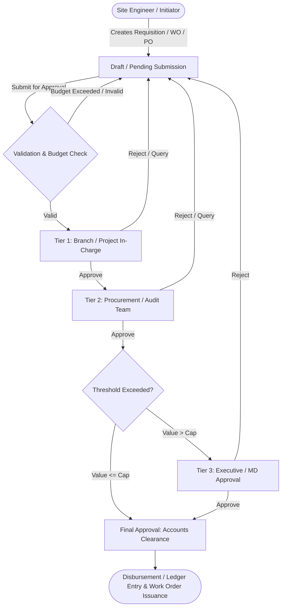

# 🏗️ Enterprise Construction MIS & Multi-Tier Approval Workflow Engine

> **Note on Confidentiality:** This repository is an anonymized technical case study and architectural overview of a production-grade enterprise Construction Management Information System (MIS) and Approval Engine. Proprietary business logic, client credentials, internal data, and private API endpoints have been omitted in compliance with non-disclosure agreements (NDA).

---

## 📌 1. Project Overview & Problem Statement

In large-scale construction and infrastructure engineering, procurement and financial approvals involve complex, high-value workflows (e.g., Site Requisitions, Purchase Orders (PO), Work Orders (WO), Contractor Advances, and Invoice Settlements). 

### The Challenge
- **Manual & Fragmented Approvals:** Delays and lack of transparency across site engineers, project managers, accounts, and executive leadership.
- **Budget Overruns & Compliance Risks:** Inability to validate requests in real-time against allocated branch/project budgets before approvals.
- **Audit Deficits:** Lack of an immutable audit trail showing who approved, modified, or rejected transactions at each stage.

### The Solution
Architected and developed a centralized **Construction MIS & Dynamic Multi-Tier Approval System** that streamlines the entire procurement and expense pipeline with configurable authorization hierarchies, role-based access control, and complete audit logging.

---

## 🏛️ 2. Key Architecture & Approval Flow

The system employs a flexible **State Machine Approval Pipeline** where transactions move through dynamic approval levels (Initiator $\to$ Reviewer $\to$ Department Head $\to$ Managing Director / Accounts) based on transaction value and department rules.

---

## 🚀 3. Core Modules & Engineering Features

### 🏢 1. Hierarchical Project & Branch Management
- Multi-branch structure linking branch areas, projects, sub-projects, and designated site managers.
- Context-aware project switching and dynamic data scoping per user authorization.

### 📜 2. Procurement & Work Order Lifecycle
- **Purchase Order (PO) Engine:** Item-level rate management, vendor tagging, and delivery milestone schedules.
- **Work Order (WO) System:** Contractor assignments, work breakdown structure (WBS) tracking, and milestone payment schedules.
- **Supplier & Contractor Advance Management:** Automatic adjustment against final invoice settlements.

### 🔐 3. Granular Role-Based Access Control (RBAC)
- Fine-grained permission matrices at module, menu, and internal-action levels (`adminAccess`, `projectAccess`).
- Strict middleware enforcement preventing horizontal privilege escalation across branches.

### 📊 4. Financial Reconciliation & Ledger Integration
- WIP (Work In Progress) vs. Expense account auto-mapping.
- Real-time project cash code utilization and expenditure analytics.

### 📝 5. Immutable Audit Logs & Action Trails
- Comprehensive audit trails capturing timestamped reviewer remarks, previous vs. modified states, and IP signatures.

---

## 🛠️ 4. Technical Stack

| Layer | Technologies / Tools |
|---|---|
| **Backend** | PHP 7.4+ / 8.x, Laravel Framework (MVC, Eloquent ORM, Custom Middleware) |
| **Database** | MySQL (Optimized with composite indexes, foreign key constraints, and normalized relations) |
| **Frontend** | Blade Templating, JavaScript (ES6+), jQuery, AJAX, Bootstrap / Custom CSS |
| **Architecture** | Modular Monolith, Service Repository Pattern, Event-driven Notification Hooks |
| **Tools** | Git, Postman, Webpack Mix, Artisan CLI |

---

## ⚡ 5. Key Engineering Challenges & Solutions

### Challenge 1: Dynamic Approval Matrix without Code Refactoring
- **Issue:** Different projects required varying approval hierarchies based on financial thresholds and organizational hierarchy.
- **Solution:** Designed a dynamic approval configuration layer with rule-based routing, decoupling workflow rules from core transaction controllers.

### Challenge 2: Slow Query Performance on Multi-Level Relational Reports
- **Issue:** Fetching cross-branch reports joining branches, projects, POs, WOs, and supplier ledgers caused N+1 query overhead.
- **Solution:** Re-engineered queries utilizing **Eager Loading (`with()`)**, indexed composite foreign keys, and selective database views, improving response time by ~65%.

### Challenge 3: Concurrency & State Inconsistency in Multi-User Approvals
- **Issue:** Race conditions where two approvers could simultaneously act on the same pending document.
- **Solution:** Implemented atomic database transactions (`DB::transaction`) and pessimistic/optimistic locking mechanisms to guarantee state consistency.

---

## 📈 6. Business Impact & Results

- ⏱️ **80% Reduction in Approval Turnaround Time:** Eliminated physical paperwork and manual handoffs across remote construction sites.
- 🎯 **100% Audit Compliance:** Every financial disbursement and material requisition mapped directly to an approved PO/WO with verifiable history.
- 📉 **Zero Duplicate Payments:** Automated advance adjustment algorithms ensured contractors and suppliers were never overpaid.

---

## 👨‍💻 7. Developer Highlights

- Designed and maintained scalable database schemas with 50+ normalized relational tables.
- Implemented robust server-side request validation and CSRF/XSS sanitization.
- Authored reusable UI components and AJAX endpoints for dynamic cascading dropdowns and instant form validations.
