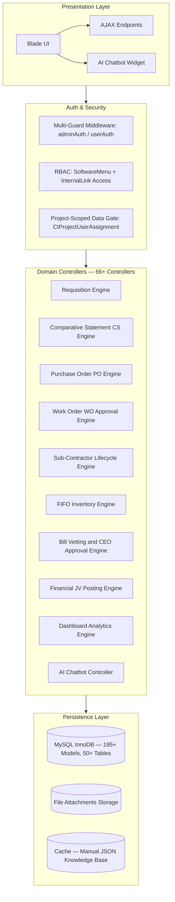
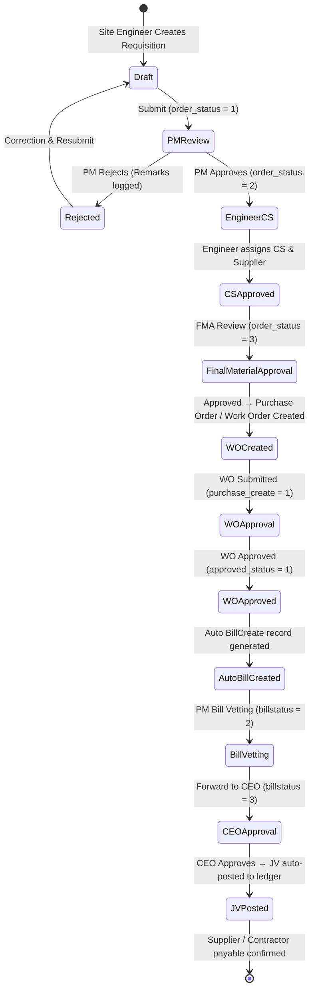
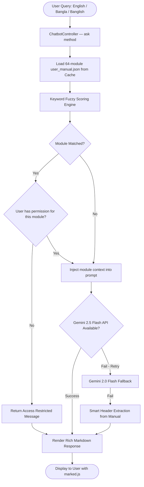

# 🏗️ Enterprise Construction MIS — Procurement, Sub-Contractor & Multi-Tier Approval Platform

[](https://laravel.com)
[](https://www.php.net/)
[](https://www.mysql.com/)
[]()
[]()
[]()

> 🔒 **Confidentiality Notice:** This is an anonymized technical case study of a production enterprise Construction MIS built for a real estate & civil engineering organization. Client names, credentials, production database seeds, and private API hostnames have been removed per NDA.

---

## 📑 Table of Contents

1. [Business Context & Problem Statement](#-1-business-context--problem-statement)
2. [System Architecture](#-2-system-architecture)
3. [The 5-Stage Approval State Machine (Core Engine)](#-3-the-5-stage-approval-state-machine-core-engine)
4. [Key Technical Modules (Deep Dive)](#-4-key-technical-modules-deep-dive)
5. [Database Design & FIFO Stock Engine](#-5-database-design--fifo-stock-engine)
6. [AI-Powered Hybrid ERP Chatbot](#-6-ai-powered-hybrid-erp-chatbot)
7. [RBAC & Multi-Guard Security Architecture](#-7-rbac--multi-guard-security-architecture)
8. [Key Engineering Challenges & Solutions](#-8-key-engineering-challenges--solutions)
9. [Tech Stack](#-9-tech-stack)
10. [Impact & Metrics](#-10-impact--metrics)

---

## 📌 1. Business Context & Problem Statement

A construction & real estate company managing multiple active projects across different geographic branches needed to replace fragmented, paper-based processes with a centralized digital platform. Key pain points:

| Pain Point | Impact |
|---|---|
| Manual Requisition → PO → WO handoffs | Weeks of delays per procurement cycle |
| No real-time budget-vs-spend tracking | BOQ overruns going undetected |
| Paper-based sub-contractor billing | Retention & advance ledgers miscalculated |
| No cross-site inventory visibility | Material double-ordering & stock wastage |
| No audit trail for financial disbursements | Compliance & fraud risk |

**The solution:** a full-stack ERP covering BOQ budgeting, material requisitions, comparative statements, purchase orders, work orders, sub-contractor lifecycle, FIFO inventory, double-entry JV posting, and a role-based approval engine — all in one platform.

---

## 🏛️ 2. System Architecture



---

## 🔄 3. The 5-Stage Approval State Machine (Core Engine)

This is the heart of the system. Every procurement document transitions through distinct stages stored as status codes on both the master record and immutable audit log tables (`requisition_approval_logs`, `work_order_approval_logs`, `bill_approval_history`).

### 📋 Requisition Status Codes
| Code | Meaning |
|------|---------|
| `0` | Draft (Initiation) |
| `1` | Submitted (Pending PM Review) |
| `2` | PM Approved → Awaiting Engineer CS Assignment |
| `3` | Engineer Approved (CS Assigned, PO Ready) |
| `4` | Final Material Approval (FMA) Granted |

### 📋 Work Order / PO Status Codes
| `approved_status` | Meaning |
|---|---|
| `0` | Pending |
| `1` | Approved |
| `2` | Rejected / Sent Back |

### 📋 Bill Status Codes (`billstatus`)
| Code | Stage |
|------|-------|
| `1` | Initiated |
| `2` | First Approval (Project Manager) |
| `3` | Final Approval Queue (CEO / MD) |
| `4` | Sub-Contractor Bill Stage |



---

## 📦 4. Key Technical Modules (Deep Dive)

### 🧾 4.1 Work Order (WO) Approval Engine
**File:** `WorkOrderApprovalController.php`

The WO approval action (`approveAction`) wraps all state transitions in a **single atomic `DB::transaction()`**:

```php
DB::beginTransaction();
try {
    // 1. Update RequisitionMaster: wo_approval_status, wo_approved_by, wo_approved_at
    // 2. Update PurchaseOrderMaster: approved_status, approved_by, approved_date
    // 3. Log immutable audit entry to WorkOrderApprovalLog
    // 4. On APPROVAL: Auto-generate BillCreate (Supplier Advance) if advance_amount > 0
    // 5. Auto-generate approved IndentInfo for payment pipeline
    // On REJECTION: Cascade-reset CS statuses on all requisition_details rows
    DB::commit();
} catch (\Exception $e) {
    DB::rollback(); // Full atomic rollback on any failure
}
```

**Rejection cascade resets the entire CS pipeline:**
```php
DB::table('requisition_details')->where('requisition_master_id', $requisitionId)->update([
    'purchase_cs_status' => 0,
    'purchase_create' => 0,
    'purchase_cs_supplier_id' => null,
    'purchase_cs_price' => null,
    'is_non_cs' => 0
]);
```

---

### 💰 4.2 CEO Bill Approval → Automatic Double-Entry JV Posting
**File:** `BillApprovedController.php`

When the CEO approves a bill (`updateState()`), the system automatically generates balanced **double-entry accounting journal vouchers** and updates supplier ledgers — no manual bookkeeping:

**For Sub-Contractor Bills (`bill_for = 2`):**
```
DR  WIP Contractor Account    →  bill_amount  (wip_contractor config code)
CR  A/P Contractor Account    →  bill_amount  (acc_payable_contractor config code)
+ Creates SubContractorBillLeadger entry (ledger_type = 1: Bill)
```

**For Material Purchase Bills (`bill_for = 1`):**
```
DR  WIP Material Account      →  per-category total amount  (wip_material config code)
CR  A/P Supplier Account      →  grand_total_amount  (acc_payable_supplier config code)
+ Creates PurchaseMaster (SPB type) + PurchaseLedger entries
```

**Safety guard before CEO approval:**
```php
// Prevents over-approval beyond contract value:
$due_bill = $total_agreement_value - $total_previously_approved_bills;
if ($billCreate->total_amount > $due_bill) {
    return 422; // Blocked: Bill exceeds remaining contract value
}
```

---

### 🔍 4.3 Engineer Approval with Project-Scoped Filtering
**File:** `EngineerApprovalController.php`

The Engineer approval list uses **correlated subqueries** to pull reviewer identity from the audit log without extra round trips:

```php
->addSelect([
    'pm_approved_by' => User_user::select('name')
        ->join('requisition_approval_logs', ...)
        ->where('requisition_approval_logs.stage', 1)   // Stage 1 = PM
        ->where('requisition_approval_logs.action', 1)  // 1 = Approved
        ->whereColumn('requisition_approval_logs.requisition_master_id', 'requisition_master.id')
        ->limit(1)
])
```

Non-admin users are automatically scoped to only their **assigned projects**:
```php
if (!$isAdmin) {
    $assigned_project_ids = CtProjectUserAssignment::where('user_id', $user->id)->pluck('ct_project_id');
    $query->whereIn('requisition_master.ct_project_id', $assigned_project_ids);
}
```

---

### 📊 4.4 Real-Time Dashboard Analytics
**File:** `DashboardController.php`

The dashboard surfaces cross-module KPIs in a single page load using scoped aggregate queries:

```php
// Total procurement spend across assigned projects
$data['purchase_amount'] = PurchaseMaster::valid()
    ->whereIn('ct_project_id', $assignedProjectIds)
    ->where('ledger_type', 1)
    ->sum('total_amount');

// Total project contract value vs collections
$data['sales_amount'] = CtProjects::valid()
    ->whereIn('id', $assignedProjectIds)->sum('total_project_value');

$data['bill_collect_amount'] = CtProjectsBill::valid()
    ->whereIn('project_id', $assignedProjectIds)->sum('collect_amount');
```

---

## 🗄️ 5. Database Design & FIFO Stock Engine

### Entity Relationship Summary
```
ct_projects (Project Registry)
    └── ct_project_pos (Purchase Orders / PO Registry)
            └── requisition_master (Material Requisitions)
                    ├── requisition_details (Line Items: Products, Quantities, CS Prices)
                    ├── requisition_approval_logs (Immutable Approval Audit Trail)
                    └── purchase_order_master (Work Orders / POs after CS)
                            ├── work_order_approval_logs (WO Audit Trail)
                            ├── bill_create (Bill Vetting Pipeline)
                            │       └── bill_approval_history (CEO Approval Logs)
                            └── purchase_master → purchase_ledgers (Supplier Ledger)

ct_sub_contractor (Sub-Contractor Registry)
    └── sub_contractor_agreement (WBS Agreement + Retention Rules)
            ├── sc_contract_cs_master (Sub-Contractor CS)
            ├── ct_contractor_bill (Running Bills)
            └── sub_contractor_bill_leadger (Payment & Advance Ledger)

stock_fifo (FIFO Inventory Engine)
    └── ew_account_transactions (Double-Entry General Ledger)
```

### FIFO Inventory Engine (`StockFifo` Model)

The FIFO engine records every material batch received (inward) and consumed (outward) with its exact unit purchase price. Valuations are always calculated against the **oldest available batch first**:

```php
// Record a new inward batch (Goods Receipt):
StockFifo::in([
    'product_id'     => $productId,
    'quantity'       => $receivedQty,      // stock_in & remaining_qty set to same value
    'purchase_price' => $unitCost,         // Exact per-batch cost locked at receipt
    'ct_project_id'  => $projectId,
    'po_id'          => $poId,
    'invoice_date'   => $receiptDate,
]);

// Query available batches for outward FIFO deduction:
StockFifo::getBatchesForOut($productId, $branchId, $ctProjectId, $poId)
// Returns batches grouped by invoice_date ASC, where (stock_in - stock_out) > 0
// Consumption deducts from oldest batch first → true FIFO valuation
```

---

## 🤖 6. AI-Powered Hybrid ERP Chatbot

An intelligent contextual assistant embedded system-wide, built as a **RAG-Lite (Retrieval-Augmented Generation) hybrid**:



**Key capabilities:**
- **Offline-First:** Works 100% without internet via structured manual extraction
- **RBAC-Aware:** Will not explain restricted modules to unauthorized users
- **Multi-turn Memory:** Remembers last 10 Q&A pairs per session
- **Multilingual:** English, Bengali, and transliterated Banglish

---

## 🛡️ 7. RBAC & Multi-Guard Security Architecture

The system enforces a **3-dimensional authorization model**:

```
Layer 1: Authentication Guard
    ├── adminAuth guard  → Software Admin Panel
    └── userAuth guard   → Project User Panel

Layer 2: Menu & Module Access (Dynamic RBAC)
    ├── SoftwareMenu / SoftwareModules
    ├── SoftwareInternalLink
    └── adminAccess / projectAccess middleware

Layer 3: Data Scoping
    └── CtProjectUserAssignment
        → Each non-admin user sees ONLY their assigned projects' data
        → Prevents horizontal privilege escalation across branches
```

**Route protection example (actual route config pattern):**
```php
Route::get('engineerApproval', [
    'as'     => 'engineerApproval',
    'access' => ['resource|requisition.index'],   // RBAC resource guard
    'uses'   => 'EngineerApprovalController@index'
]);
```

---

## 💡 8. Key Engineering Challenges & Solutions

| # | Challenge | Solution |
|---|---|---|
| **1** | **Atomic WO Approval with Auto Billing** — On approval, multiple tables (PO master, Requisition, IndentInfo, BillCreate) must all update or none should. | Wrapped the entire approval pipeline in `DB::beginTransaction()` / `commit()` / `rollback()`. Any exception triggers a full rollback across all tables. |
| **2** | **Contract Value Overrun Prevention** — CEO couldn't visually calculate remaining payable vs. cumulative approved bills. | Engineered a real-time guard: `$due = agreement_value - SUM(previously_approved_bills)`. If `new_bill > $due` → 422 rejection with specific overrun amount in the message. |
| **3** | **Cascading Rejection** — When a WO is rejected, all downstream CS assignments, supplier selections, and price quotes must be atomically reversed. | A rejection triggers a **bulk reset** on `requisition_details` (CS status, supplier, price, non-CS flag — all reset to null/0) + IndentInfo reversal in one transaction. |
| **4** | **Project-Scoped Data Isolation** — Non-admin users accessing data from other projects' procurement records. | Every query for non-admins enforces `whereIn('ct_project_id', $assigned_project_ids)` via `CtProjectUserAssignment`. Scope is baked into the base model's `scopeValid()`. |
| **5** | **Accurate FIFO Inventory Valuation** — Average costing skewed project P&L when material prices fluctuated between shipments. | Built a custom `StockFifo` engine. Each receipt batch locks its `purchase_price`. Consumption queries batch by `invoice_date ASC`, deducting from `remaining_qty` of oldest batches first. |
| **6** | **Correlated Subquery for Audit Identity** — Showing who approved at each stage in a single list query without N+1 joins. | Used Laravel `addSelect()` with correlated subqueries against `requisition_approval_logs` filtered by `stage` and `action` — returns approver name without extra eager-load overhead. |

---

## 💻 9. Tech Stack

| Layer | Tools & Technologies |
|---|---|
| **Backend** | PHP 7.4 / 8.x, Laravel Framework, Eloquent ORM, Custom Middleware |
| **Database** | MySQL 8.x, InnoDB, `DB::transaction()`, `lockForUpdate()`, Raw Queries |
| **Frontend** | Blade Templates, JavaScript ES6+, jQuery, AJAX, Bootstrap 4/5 |
| **AI / NLP** | Google Gemini 2.5 Flash + 2.0 Flash (fallback), RAG-lite fuzzy keyword engine |
| **Architecture** | Modular Monolith, Repository-style Services, Event-driven State Transitions |
| **Dev Tools** | Composer, Git, Webpack Mix, Artisan CLI, Postman |

---

## 📊 10. Impact & Metrics

| Metric | Before | After |
|---|---|---|
| Procurement Cycle Time | 2–3 weeks (manual) | 2–3 days (digital) |
| Duplicate/Over-payment Risk | High (no checks) | Zero (contract guard enforced) |
| Audit Traceability | None | 100% (every stage logged) |
| Inventory Valuation Accuracy | ± Estimated | Exact FIFO per batch |
| Report Generation Time | Hours (manual Excel) | Seconds (live dashboard queries) |

---

<p align="center">
  <strong>Architected & Developed by Shakhawat Sakib</strong><br>
  <em>Full-Stack & Backend Software Engineer · Laravel · PHP · MySQL</em>
</p>
