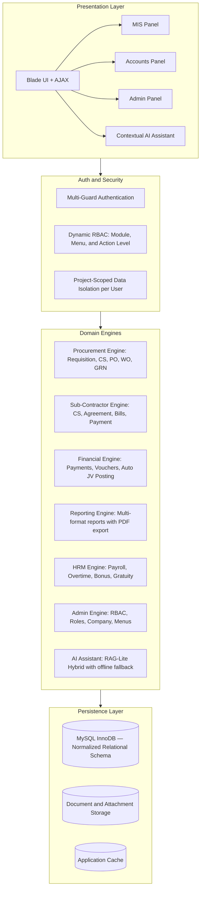
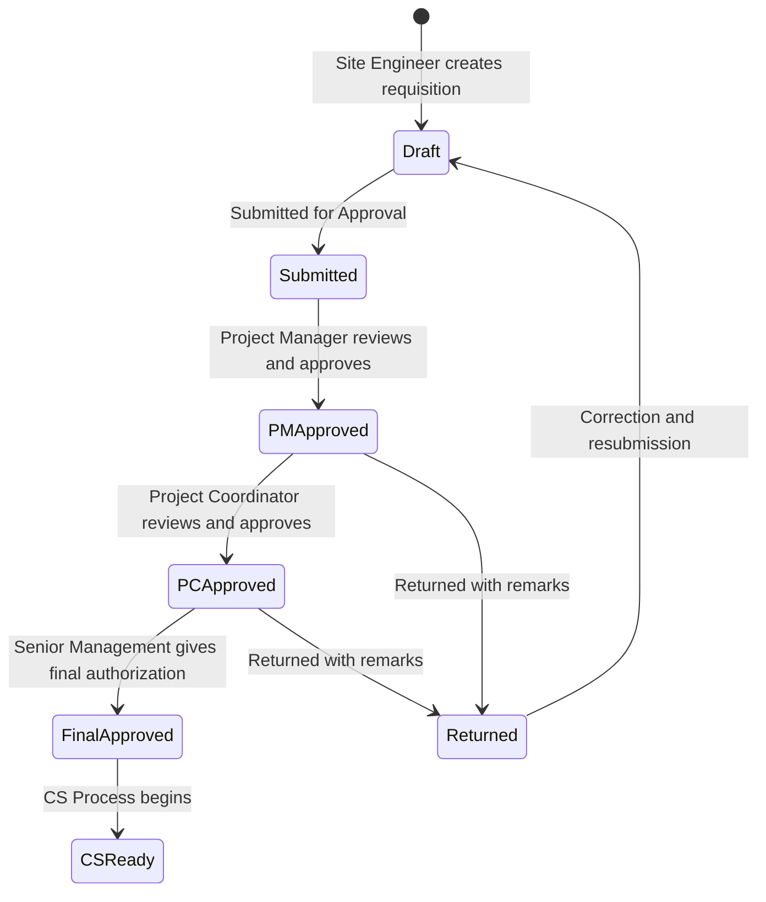
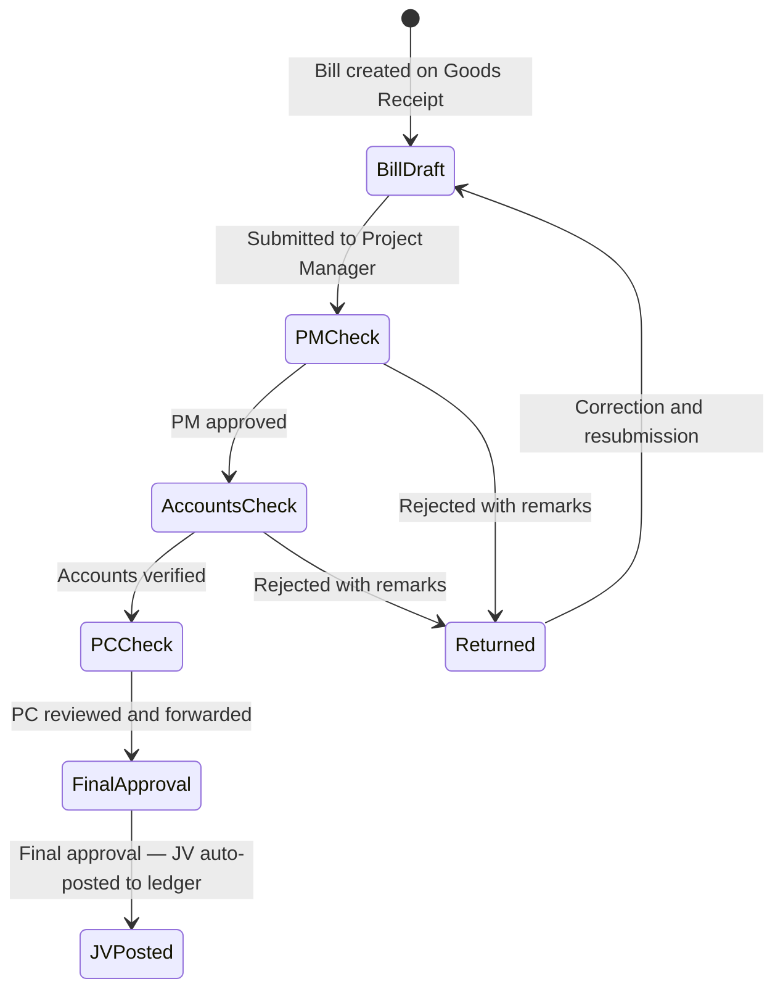
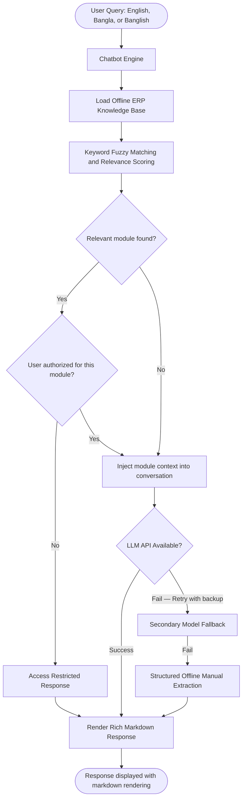

# 🏗️ Enterprise Construction MIS — Procurement, Approval Workflow & Financial Operations

[](https://laravel.com)
[](https://www.php.net/)
[](https://www.mysql.com/)
[]()

---

## 🔒 Confidential Production Project

This repository contains an **anonymized technical case study** based on a production enterprise Construction Management Information System (MIS).

The original source code, database credentials, client information, internal URLs, proprietary implementation details, and production data are intentionally excluded due to confidentiality obligations.

The documentation focuses on the **engineering problems, system design decisions, workflows, and technical responsibilities** involved in the project — not on reproducing the original system.

> See [DISCLAIMER.md](./DISCLAIMER.md) for full confidentiality notice.

---

## 📑 Table of Contents

1. [Project Context](#-1-project-context)
2. [Platform Modules Overview](#-2-platform-modules-overview)
3. [System Architecture](#-3-system-architecture)
4. [MIS Module — Core Procurement Engine](#-4-mis-module--core-procurement-engine)
5. [Accounts Module — Financial Operations](#-5-accounts-module--financial-operations)
6. [HRM Module — Human Resources Management](#-6-hrm-module--human-resources-management)
7. [Admin Module — System Configuration & Access Control](#-7-admin-module--system-configuration--access-control)
8. [Inventory: FIFO Costing Engine](#-8-inventory-fifo-costing-engine)
9. [AI-Powered Contextual Assistant](#-9-ai-powered-contextual-assistant)
10. [Key Engineering Challenges & Solutions](#-10-key-engineering-challenges--solutions)
11. [My Role & Contributions](#-11-my-role--contributions)
12. [Tech Stack](#-12-tech-stack)

---

## 📌 1. Project Context

A multi-project construction organization required a centralized digital platform to replace fragmented, paper-based processes for procurement, financial approvals, contractor management, and HR operations.

### Key Pain Points

| Pain Point | Business Impact |
|---|---|
| Manual requisition and approval handoffs | Significant delays per procurement cycle |
| No real-time budget vs. spend visibility | Budget overruns detected too late |
| Informal sub-contractor billing | Advance and retention ledgers miscalculated |
| No cross-site inventory visibility | Material over-ordering and site wastage |
| No audit trail on financial disbursements | Compliance and accountability risk |
| Manual payroll and overtime calculation | Recurring HR errors |

### The Solution

A full-stack enterprise ERP with **4 integrated modules** — MIS (Construction & Procurement), Accounts, HRM, and Admin — covering the entire project lifecycle from budget planning through financial reporting and payroll.

---

## 🏢 2. Platform Modules Overview

```
┌─────────────────────────────────────────────────────────┐
│              Enterprise Construction ERP                │
├──────────────┬─────────────┬───────────┬───────────────┤
│  MIS Module  │  Accounts   │    HRM    │     Admin     │
├──────────────┼─────────────┼───────────┼───────────────┤
│ Procurement  │ Vouchers    │ Employee  │ User & Roles  │
│ BOQ & Budget │ Payments    │ Payroll   │ Menu Config   │
│ CS & PO & WO │ JV Posting  │ Overtime  │ Company Setup │
│ GRN & Bills  │ Ledgers     │ Bonus     │ Branch & Area │
│ Sub-contract │ Fin. Reports│ Gratuity  │ Role-based    │
│ Inventory    │ Statements  │ Incentive │ Access Matrix │
│ Consumption  │ Balance Sht │ Reports   │               │
│ Reporting    │ Trial Bal.  │           │               │
└──────────────┴─────────────┴───────────┴───────────────┘
```

---

## 🏛️ 3. System Architecture

The application is structured as a **modular monolith** with clearly separated domain boundaries for each business function.



---

## 🔧 4. MIS Module — Core Procurement Engine

### 4.1 BOQ (Bill of Quantities) & Budget Management

- Item-level quantity estimation and unit rate setup per project
- BOQ summary and detail views with document attachment support
- Real-time deviation tracking: planned budget vs. cumulative orders placed

### 4.2 Material Requisition — Multi-Stage Approval Workflow

Every material requisition follows a strict, role-enforced approval chain before any procurement action is taken:



Each approval step is captured in an immutable audit log — including the reviewer's identity, timestamp, action, and remarks — ensuring full chain-of-custody traceability.

### 4.3 Comparative Statement (CS) Engine

After approval, the procurement team conducts a structured competitive vendor evaluation:

**Material CS:** Multi-supplier price comparison per line item, evaluating unit price, payment terms, and delivery lead time. A committee vetting stage finalizes the selected supplier and agreed rate before a Purchase Order is raised.

**Sub-Contractor CS:** Task-rate comparison across civil and labour contractors. Supports multi-party quotation matrices. Reversals are tracked with audit remarks.

### 4.4 Purchase Order (PO) & Work Order (WO) Lifecycle

Following CS finalization, a Purchase Order or Work Order is generated:

- Tracks supplier, confirmed rate, advance terms, and item-level breakdown
- Supports both CS-based and direct emergency purchases

**Work Order Approval:**

| Stage | Meaning |
|---|---|
| Pending | Awaiting authorization |
| Approved | Authorized for execution |
| Rejected | Returned — full pipeline reset required |

On **approval**, the system atomically:
- Updates all relevant records with approver identity and timestamp
- Logs an immutable audit entry
- Auto-generates a supplier advance payable record if an advance was agreed

On **rejection**, a cascading reset atomically reverses all comparative statement assignments, supplier selections, agreed prices, and related records on every affected line — returning the document cleanly to draft state.

All these operations execute within a single database transaction: everything commits together, or a full rollback occurs on any failure.

### 4.5 Goods Receipt Note (GRN)

Records physical receipt of materials against approved orders:

- Supports partial deliveries and multi-batch receives
- Each batch is logged with quantity and unit cost into the FIFO inventory engine
- Linked to the originating order for three-way matching

### 4.6 Bill Vetting — Multi-Stage Financial Approval

After goods receipt, supplier invoices undergo a structured financial vetting pipeline:



On final approval, the system automatically generates balanced double-entry journal voucher entries — eliminating all manual bookkeeping for procurement transactions.

A built-in **contract overrun guard** automatically blocks approval if the bill amount would exceed the remaining payable balance under the contractor's agreement.

### 4.7 Sub-Contractor Full Lifecycle

```
Sub-Contractor Registration
    └── Competitive Quotation (CS)
            └── Agreement (WBS, Retention %, Advance Terms)
                    ├── Running Bill Submission
                    │       └── Vetting Pipeline → Final Approval → Auto JV
                    ├── Advance Disbursement (auto-amortized in future bills)
                    └── Final Payment (with Retention Release)
```

Running bills automatically deduct mobilization advance recovery, retention holdbacks, and any agreed penalty adjustments.

### 4.8 Material Consumption

Tracks how materials are drawn from site stock for construction activities:

- Item-wise consumption recorded per work category and site
- FIFO engine deducts from the oldest available stock batch first
- Full consumption history maintained for project cost reconciliation

### 4.9 Inter-Project Stock Transfer

Transfers materials between construction sites to balance inventory:

- Source site releases from FIFO stock (outward deduction)
- Destination site receives into FIFO stock (inward batch creation)
- Transfer requires confirmation from the receiving site
- Full dispatch-and-receipt audit trail maintained

### 4.10 MIS Reports

Reporting covers the full procurement and inventory lifecycle:

| Category | Report Types |
|---|---|
| **Procurement** | Order Sheet, Purchase Summary, Raw Material Purchase, Purchase Advance |
| **Inventory** | Stock Summary, Stock Details, Hand Upto Date, Stock Receiving |
| **Stock Movement** | By Product, By Product Group, History, Transfer Report |
| **Consumption** | Consumption List, Consumption by Project |
| **Project Finance** | Project Details, Income vs. Expense, Project Estimation |
| **Supplier & Contractor** | Bill Reports, Payment Reports |
| **Collections** | Due Collection, Invoice Reports, Sales Reports |

All reports support on-screen view and PDF export.

---

## 💰 5. Accounts Module — Financial Operations

### 5.1 Voucher Management

Nine types of financial vouchers are supported, covering cash, bank, and journal transactions for different business contexts (general, employee, sub-contractor, bill, and CMR entries).

### 5.2 Payment Processing

| Payment Type | Description |
|---|---|
| Supplier Payment | Final settlement after bill approval |
| Supplier Advance Payment | Pre-delivery advance against Work Orders |
| Direct Purchase Payment | Direct payment outside the GRN pipeline |
| Sub-Contractor Payment | Milestone-based payments |
| Sub-Contractor Advance | Mobilization advance disbursement |
| Employee Advance | Staff cash advance requests |
| Project Advance | Project-level advance drawdowns |
| Due Collection | Client invoice collection and reconciliation |

### 5.3 WIP to Expense Conversion

As project milestones are completed, Work-in-Progress (WIP) asset balances are converted to operational expense accounts via automatically generated balancing journal entries — ensuring accurate financial period reporting.

### 5.4 Financial Reports

| Category | Report Types |
|---|---|
| **Financial Statements** | Trial Balance, Balance Sheet, Receipts & Payments |
| **Ledger Reports** | General Ledger, Third-Party Ledger |
| **Cash & Bank** | Cash Book, Bank Book |
| **Payables & Receivables** | Accounts Payable, Accounts Receivable |
| **Party Statements** | Supplier, Contractor, Customer statements |
| **Other** | Employee Advance Statement, Collectable Reports, Voucher Print |

---

## 👥 6. HRM Module — Human Resources Management

- **Employee Management:** Profiles with department, designation, branch, and system account linkage
- **Payroll Engine:** Automated monthly payroll — salary components, advance deductions, loan recovery, and payslip generation
- **Overtime:** Daily recording with configurable rates, integrated into monthly payroll
- **Bonus & Incentive:** Festival and performance-based bonus disbursement with individual allocation tracking
- **Gratuity:** End-of-service calculation based on service tenure and company policy

---

## ⚙️ 7. Admin Module — System Configuration & Access Control

### 7.1 Dynamic RBAC (3-Layer Authorization)

```
Layer 1 — Authentication
    ├── Project User Panel (MIS + Accounts)
    └── Software Admin Panel (system-level configuration)

Layer 2 — Permission Enforcement
    ├── Module-level visibility
    ├── Sidebar menu item access
    ├── Individual action permissions (create, edit, delete, view)
    └── Middleware validates every request against the user's active permissions

Layer 3 — Data Scope
    └── Each non-admin user is restricted to only their explicitly assigned
        projects — preventing any cross-branch or cross-project data access
```

### 7.2 Role Management

Predefined named roles bundle permission sets. Users can inherit a role and receive further individual customization on top of that role's baseline.

### 7.3 Organization Setup

Branch and area hierarchy, company profile, global salary policy, multi-currency support, and per-user dashboard widget visibility control.

---

## 📦 8. Inventory: FIFO Costing Engine

Every material receipt creates a **locked batch record** with its exact unit purchase cost at the time of delivery. This cost is never modified retroactively.

**Inward (Goods Receipt):** Batch created with received quantity and locked unit cost.

**Outward (Consumption / Transfer):** Available batches are processed in chronological order — oldest batch deducted first. This ensures true First-In-First-Out costing.

This approach guarantees project cost reports reflect actual, batch-level material costs rather than averages — essential for accurate project P&L and budget variance analysis.

---

## 🤖 9. AI-Powered Contextual Assistant

An intelligent multilingual assistant embedded across all modules:



**Key Capabilities:**
- **Offline-First:** Fully functional without internet via structured manual extraction
- **Permission-Aware:** Only guides users on modules they are authorized to access
- **Multi-turn Memory:** Maintains conversation context across multiple exchanges
- **Multilingual:** Understands English, Bengali, and transliterated Banglish

---

## 💡 10. Key Engineering Challenges & Solutions

### Challenge 1: Multi-Role, Multi-Step Approval Chains
**Problem:** Different document types required different sequential approval hierarchies with distinct role requirements at each stage. Any bypass or out-of-order action would undermine the financial control framework.

**Solution:** Each document maintains a status code representing its current approval stage. The application layer enforces permitted transitions and required roles. Every state change is committed to an append-only audit log — creating a tamper-proof chain of custody.

---

### Challenge 2: Atomic Multi-Table Updates on Approval
**Problem:** Approving a document requires updating multiple related records simultaneously. A partial failure mid-way would leave the system in an inconsistent state.

**Solution:** All approval actions are wrapped in a single database transaction. If any step fails, the entire operation rolls back — guaranteeing consistency regardless of concurrent load or unexpected errors.

---

### Challenge 3: Cascading Rejection Reset
**Problem:** When a document is rejected, all downstream records — vendor assignments, agreed prices, advance records — must be simultaneously reverted to allow the process to restart cleanly.

**Solution:** Rejection triggers a bulk update resetting all affected records across all related entries within the same transaction. This eliminates partial resets and ensures the document returns to a clean, restartable state.

---

### Challenge 4: Contract Overrun Prevention
**Problem:** Approvers could not reliably determine whether cumulative approved amounts were approaching or exceeding the agreed contract ceiling, risking over-payment.

**Solution:** Before any bill approval is committed, the system calculates the remaining payable balance and compares it against the new bill amount. If the bill would cause an overrun, approval is automatically blocked and the exact excess amount is returned in the error response.

---

### Challenge 5: Accurate FIFO Material Costing
**Problem:** Using average material costs across fluctuating-price shipments produced inaccurate project P&L and cost variance reports.

**Solution:** The inventory engine locks the unit purchase cost per batch at the time of goods receipt. All consumption and transfer valuations draw from these locked costs in chronological order — producing exact, batch-level costing that accurately reflects real procurement expenditure.

---

### Challenge 6: Project-Level Data Isolation
**Problem:** Without strict scoping, users from one branch could access procurement, inventory, or financial records belonging to other projects — a compliance and confidentiality risk.

**Solution:** A project assignment layer governs which projects each non-admin user may access. Every data query for non-admin users is automatically scoped to their permitted projects at the application layer — enforced consistently across all modules.

---

## 👨‍💻 11. My Role & Contributions

**Role:** Backend & Full-Stack Developer (PHP / Laravel)

**Key Contributions:**

- Designed and implemented the multi-stage requisition and bill approval workflows, including state management, audit logging, and role-based enforcement
- Built the Comparative Statement engine for both material and sub-contractor procurement flows
- Developed the Work Order lifecycle, including approval, automatic advance payable generation, and cascading rejection logic
- Implemented the FIFO inventory engine for batch-level stock costing, consumption, and inter-project transfer
- Built the automatic double-entry journal voucher posting system triggered on bill approval
- Engineered the contract overrun guard and other financial validation layers
- Developed the three-layer RBAC system: authentication guards, dynamic menu and action permissions, and project-scoped data isolation
- Contributed to sub-contractor lifecycle management: CS, agreement, running bills, and payment settlement
- Built and integrated the AI-powered multilingual ERP assistant with offline fallback
- Developed report generation across procurement, inventory, financial, and project modules
- Contributed to the HRM module: payroll engine, overtime, bonus, and gratuity processing

---

## 💻 12. Tech Stack

| Layer | Technologies |
|---|---|
| **Backend** | PHP 7.4 / 8.x, Laravel Framework (MVC, Eloquent ORM, Middleware, Events) |
| **Database** | MySQL 8.x (InnoDB, normalized schema, database transactions, locking) |
| **Frontend** | Blade Templates, JavaScript (ES6+), jQuery, AJAX, Bootstrap 4/5 |
| **AI / NLP** | LLM-based conversational assistant with rule-based offline fallback |
| **Architecture** | Modular Monolith, State-Machine Approval Flows, Event-driven Auto-Posting |
| **Tooling** | Composer, Git, Webpack, Artisan CLI, Postman, PDF Generation |
