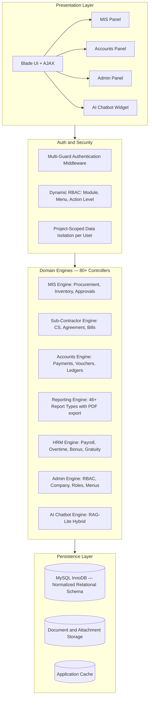
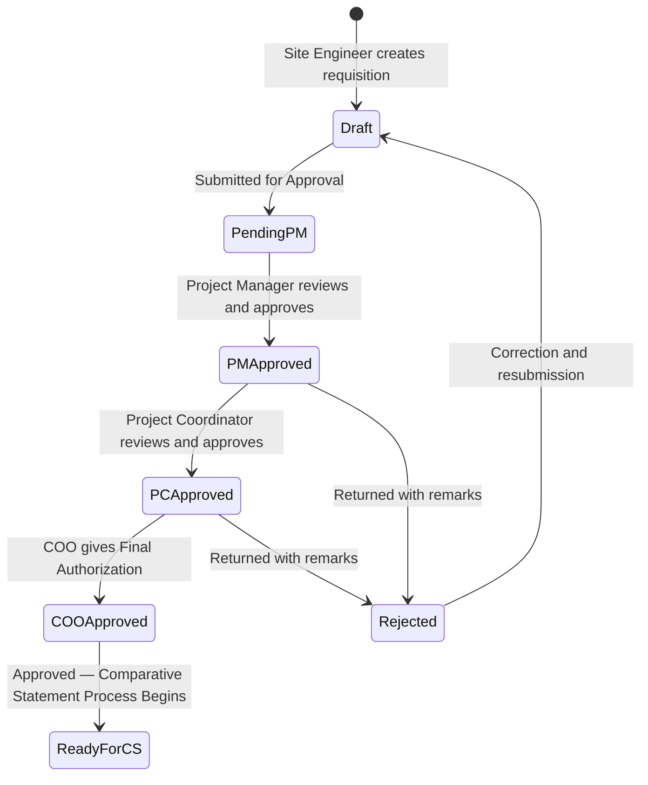
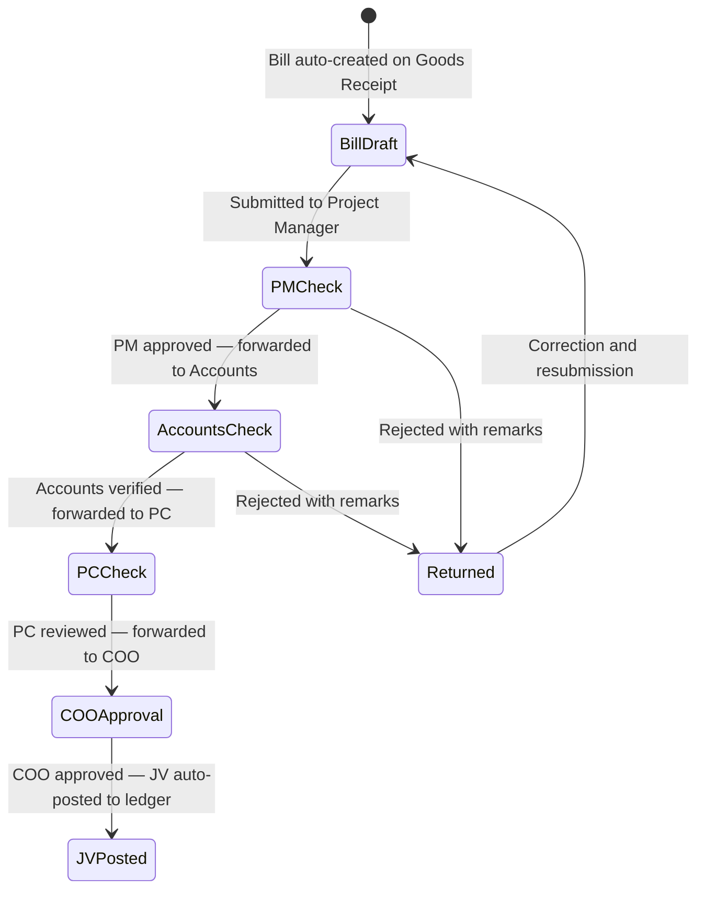
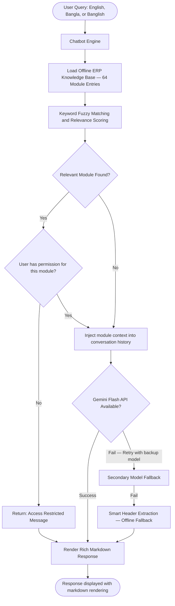

# 🏗️ Enterprise Construction MIS — Procurement, Sub-Contractor & Approval Workflow Platform

[](https://laravel.com)
[](https://www.php.net/)
[](https://www.mysql.com/)
[]()
[]()
[]()

> 🔒 **Confidentiality Notice:** This is an anonymized technical case study of a production enterprise Construction MIS built for a real estate & civil engineering organization. Specific implementation details, internal credentials, client data, and proprietary architecture have been omitted per NDA.

---

## 📑 Table of Contents

1. [Business Context & Problem Statement](#-1-business-context--problem-statement)
2. [Platform Modules Overview](#-2-platform-modules-overview)
3. [System Architecture](#-3-system-architecture)
4. [MIS Module — Core Procurement Engine](#-4-mis-module--core-procurement-engine)
5. [Accounts Module — Financial Operations](#-5-accounts-module--financial-operations)
6. [HRM Module — Human Resources Management](#-6-hrm-module--human-resources-management)
7. [Admin Module — System Configuration & Access Control](#-7-admin-module--system-configuration--access-control)
8. [FIFO Inventory Engine](#-8-fifo-inventory-engine)
9. [AI-Powered Hybrid ERP Chatbot](#-9-ai-powered-hybrid-erp-chatbot)
10. [Key Engineering Challenges & Solutions](#-10-key-engineering-challenges--solutions)
11. [Tech Stack](#-11-tech-stack)
12. [Impact & Metrics](#-12-impact--metrics)

---

## 📌 1. Business Context & Problem Statement

A construction and real estate organization managing multiple active projects across different geographic branches required a centralized digital platform to replace fragmented, paper-based processes.

### Key Pain Points

| Pain Point | Business Impact |
|---|---|
| Manual, paper-based requisition and approval handoffs | 2–3 weeks per procurement cycle |
| No real-time budget vs. spend visibility | BOQ overruns discovered only after the fact |
| Informal sub-contractor billing | Advance and retention ledgers miscalculated |
| No cross-site inventory visibility | Material double-ordering and site wastage |
| Zero audit trail on financial disbursements | Compliance and fraud exposure |
| Manual payroll and overtime calculation | Recurring HR disputes and errors |

### The Solution

A full-stack enterprise ERP with **4 tightly integrated modules** — MIS (Construction & Procurement), Accounts, HRM, and Admin — covering the entire project lifecycle from initial budgeting through to financial statement generation.

---

## 🏢 2. Platform Modules Overview

```
┌──────────────────────────────────────────────────────────┐
│              Enterprise Construction ERP                 │
├──────────────┬──────────────┬───────────┬───────────────┤
│  MIS Module  │   Accounts   │    HRM    │     Admin     │
├──────────────┼──────────────┼───────────┼───────────────┤
│ Procurement  │ Vouchers     │ Employee  │ User & Roles  │
│ BOQ & Budget │ Payments     │ Payroll   │ Menu & Access │
│ CS & PO & WO │ JV Posting   │ Overtime  │ Company Setup │
│ GRN & Bills  │ Ledgers      │ Bonus     │ Branch & Area │
│ Sub-contract │ Fin. Reports │ Gratuity  │ Role-based    │
│ Inventory    │ Trial Balance│ Incentive │ Access Matrix │
│ Consumption  │ Balance Sheet│ HRM Rpts  │ DB Backup     │
│ 31 Reports   │ 15 Reports   │           │               │
└──────────────┴──────────────┴───────────┴───────────────┘
```

---

## 🏛️ 3. System Architecture



---

## 🔧 4. MIS Module — Core Procurement Engine

The MIS module drives the full construction procurement and project management lifecycle.

### 4.1 BOQ (Bill of Quantities) & Budget Management

- Item-level quantity estimation and unit rate setup per project and PO
- BOQ summary and detail view with attachment support
- Real-time deviation tracking: allocated budget vs. cumulative orders placed

### 4.2 Material Requisition — 5-Stage Approval Workflow

Every material requisition is subject to a strict, role-enforced multi-tier approval chain before any procurement action can be taken:



Each approval step is recorded in an immutable audit log capturing the reviewer's identity, timestamp, action taken, and remarks.

### 4.3 Comparative Statement (CS) Engine

After approval, the procurement team conducts a structured, competitive vendor evaluation:

**Material CS:**
Multi-supplier quote comparison on a per-item basis. Each vendor quote captures unit price, payment terms, and delivery lead time. A committee review stage validates and finalizes the selected supplier and agreed rate before a Purchase Order can be raised.

**Sub-Contractor CS:**
Task-rate comparison across specialized civil and labour contractors. Supports multi-party quotation matrices evaluated on scope, rate, and capability. Reversals are tracked with audit remarks.

### 4.4 Purchase Order (PO) & Work Order (WO) Lifecycle

After CS finalization, a Purchase Order or Work Order is generated against the confirmed supplier:

- Tracks supplier, confirmed rate, advance amount, item breakdown, and order date
- Supports both CS-based orders and direct (non-CS) emergency purchases

**Work Order Approval (3-Stage):**

| Stage | Meaning |
|---|---|
| Pending | Awaiting authorization |
| Approved | Work Order authorized for execution |
| Rejected | Returned with remarks — full pipeline reset |

On **approval**, the system atomically:
- Updates the requisition and work order records with approver and timestamp
- Logs an immutable approval audit entry
- Auto-generates a supplier advance payable record if an advance was agreed

On **rejection**, a cascading reset atomically reverses all CS assignments, supplier selections, agreed prices, and advance records on every affected line item — returning the document to draft state.

All these actions execute within a single database transaction: either every update commits together, or a full rollback occurs on any failure.

### 4.5 Goods Receipt Note (GRN)

Records the physical receipt of materials against approved orders:

- Supports partial deliveries and multi-batch receives
- Each batch received is logged with quantity and unit cost into the FIFO stock engine
- Linked back to the originating order for three-way matching validation

### 4.6 Bill Vetting & COO Final Bill Approval — 5-Stage Pipeline

After goods receipt, supplier invoices go through a multi-stage financial vetting process before funds are disbursed:



On COO approval, the system automatically generates balanced **double-entry journal voucher** entries against configured account codes — eliminating all manual bookkeeping for procurement transactions.

A built-in **contract overrun guard** prevents COO approval if the bill amount would exceed the remaining payable balance under the associated contractor agreement.

### 4.7 Sub-Contractor Full Lifecycle

A dedicated procurement sub-flow manages the complete lifecycle of specialized civil and labour contractors:

```
Sub-Contractor Registration
    └── Competitive Quotation (Sub-Contractor CS)
            └── Agreement Creation (WBS, Retention %, Advance Terms)
                    ├── Running Bill Submission
                    │       └── Bill Vetting → COO Approval → JV Auto-Posting
                    ├── Advance Payment (with automatic recovery scheduling)
                    └── Final Payment (with Retention Release)
```

Running bills automatically deduct:
- Mobilization advance amortization (recovered proportionally)
- Retention money (security holdback per agreement terms)
- Any site damage or penalty adjustments

### 4.8 Material Consumption

Tracks how materials are drawn from site stock and consumed in construction activities:

- Site staff record item-wise consumption per work category
- The FIFO engine deducts from the oldest available stock batch first
- Full consumption history is maintained for project cost reconciliation

### 4.9 Inter-Project Stock Transfer

Enables materials to be transferred between construction sites to balance inventory:

- Source project releases from its FIFO stock (outward deduction)
- Destination project receives into its FIFO stock (inward batch creation)
- Transfer requires confirmation from the receiving site
- Full dispatch-and-receipt audit trail maintained

### 4.10 MIS Reports (31 Report Types)

Comprehensive reporting covering the full procurement and inventory lifecycle:

| Category | Report Types |
|---|---|
| **Procurement** | Order Sheet, Purchase Summary, Raw Material Purchase, Purchase Advance |
| **Inventory** | Stock Summary, Stock Details, Inventory Hand Upto Date, Stock Receiving |
| **Stock Movement** | Movement by Product, Movement by Product Group, Stock History, Transfer Report |
| **Consumption** | Consumption List, Consumption by Project |
| **Project Finance** | Project Details, Project Income vs. Expense, Project Estimation |
| **Supplier & Contractor** | Supplier Bill, Supplier Payment, Contractor Bill, Contractor Payment |
| **Collections** | Due Collection, Invoice Report, Sales Reports |

All reports support on-screen view and PDF export.

---

## 💰 5. Accounts Module — Financial Operations

The Accounts module manages all financial transactions, payment processing, ledgers, and statutory financial reporting across the organization.

### 5.1 Voucher Management

Nine types of financial vouchers are supported:

| Voucher Type | Purpose |
|---|---|
| Cash Payment Voucher | Cash disbursements |
| Cash Receipt Voucher | Cash receipts |
| Bank Payment Voucher | Bank-based payments |
| Bank Receipt Voucher | Bank-based receipts |
| General Journal Voucher | Manual accounting entries |
| Employee Journal Voucher | Employee-related adjustments |
| Sub-Contractor Journal Voucher | Contractor-specific entries |
| Bill Journal Voucher | Bill-related postings |
| CMR Journal Voucher | Cash/Memo/Return adjustments |

### 5.2 Payment Processing

| Payment Type | Description |
|---|---|
| Supplier Payment | Final settlement after bill approval |
| Supplier Advance Payment | Pre-delivery advance against Work Orders |
| Direct Purchase Payment | Direct payment without GRN pipeline |
| Sub-Contractor Payment | Milestone-based contractor payment |
| Sub-Contractor Advance | Mobilization advance disbursement |
| Employee Advance | Staff cash advance requests |
| Project Advance | Project-level advance drawdowns |
| Due Collection | Client invoice collection and reconciliation |

### 5.3 WIP to Expense Conversion

As project milestones are completed, Work-in-Progress (WIP) asset balances are transferred to operational expense accounts:

- Account-level WIP configuration maps project categories to WIP codes
- WIP-to-Expense conversion creates balanced journal entries automatically
- Ensures correct financial period reporting as project costs are realized

### 5.4 Financial Reports (15 Report Types)

Full statutory and management reporting:

| Category | Report Types |
|---|---|
| **Financial Statements** | Trial Balance, Balance Sheet, Receipts & Payments |
| **Ledger Reports** | General Ledger Query, Third-Party Ledger Query |
| **Cash & Bank** | Cash Book, Bank Book |
| **Payable & Receivable** | Accounts Payable, Accounts Receivable |
| **Party Statements** | Supplier Statement, Contractor Statement, Customer Statement |
| **Employee** | Employee Purchase Advance Statement |
| **Other** | Collectable Income/Expense, Voucher Print |

---

## 👥 6. HRM Module — Human Resources Management

### 6.1 Employee Management
Complete employee profiles with department, designation, branch, and system user account linkage.

### 6.2 Payroll Engine
Automated monthly payroll covering:
- Basic salary, house rent, medical, and allowance components
- Advance deductions and loan recovery scheduling
- Monthly salary slips and payroll summary reports

### 6.3 Overtime Management
- Daily overtime recording with configurable pay rates
- Automatic integration into monthly salary processing

### 6.4 Bonus, Incentive & Gratuity
- Festival and performance bonus disbursement with individual allocation records
- Target-based incentive tracking
- End-of-service gratuity calculation based on service tenure per company policy

---

## ⚙️ 7. Admin Module — System Configuration & Access Control

### 7.1 Dynamic RBAC (3-Layer Authorization)

```
Layer 1 — Authentication
    ├── Project User Panel (MIS + Accounts access)
    └── Software Admin Panel (system-level configuration)

Layer 2 — Menu and Action Permissions
    ├── Module-level visibility
    ├── Sidebar menu item access
    ├── Individual action permissions (create, edit, delete, view)
    └── Middleware validates every request against the user's permission set

Layer 3 — Data Scope
    └── Each non-admin user is restricted to only the projects they
        are explicitly assigned to — preventing cross-branch data leakage
```

### 7.2 Role Management
Predefined named roles bundle sets of permissions. Individual users can inherit a role's permission set, which can then be further customized per user.

### 7.3 Organization Setup
- Branch and area hierarchy configuration
- Company profile and branding settings
- Global salary structure and policy rules
- Multi-currency support with per-project default currency
- Dashboard widget visibility control per user

### 7.4 Menu & Navigation Configuration
Drag-and-drop menu ordering with priority-based rendering. Separate menu trees for Admin and User panels.

---

## 📦 8. FIFO Inventory Engine

The inventory engine records every material movement with its exact unit purchase cost. Valuations are always computed against the oldest available stock batch:

**Inward (Goods Receipt):** A new batch record is created locking in the quantity received and exact unit cost at the time of receipt. The locked cost is never modified retroactively.

**Outward (Consumption / Transfer):** Available batches are queried in chronological order. Deductions consume from the oldest batch first, ensuring true First-In-First-Out costing across all project sites.

This approach guarantees that project cost reporting reflects actual, batch-level material costs rather than averages — critical for accurate project P&L and budget variance analysis.

---

## 🤖 9. AI-Powered Hybrid ERP Chatbot

An intelligent, multilingual assistant embedded across all modules:



**Key Capabilities:**
- **Offline-First:** Fully functional without internet using structured manual extraction
- **Permission-Aware:** Guides users only on modules they are authorized to access
- **Multi-turn Memory:** Maintains conversation context across multiple exchanges per session
- **Multilingual:** Understands English, Bengali, and transliterated Banglish queries

---

## 💡 10. Key Engineering Challenges & Solutions

### Challenge 1: Multi-Role, Multi-Step Approval Chains
**Problem:** Different document types required different sequential approval hierarchies. Requisitions needed 5 roles (Site Engineer → PM → PC → COO), while bills needed their own chain (PM → Accounts → PC → COO). Any bypass or out-of-order action would compromise the financial control framework.

**Solution:** Each document maintains a numeric status code representing its current approval stage. Middleware enforces the permitted transitions and the required role for each step. Every state change is committed to an immutable audit log table with approver identity, timestamp, and remarks — creating a tamper-proof chain of custody.

---

### Challenge 2: Atomicity Across Multi-Table Approval Actions
**Problem:** Approving a Work Order requires updating multiple related records simultaneously. A partial failure mid-way would leave the system in an inconsistent state — for example, an advance payable record created without the corresponding order being marked approved.

**Solution:** All approval actions are wrapped in a single database transaction. If any step fails, the entire operation rolls back atomically, leaving all affected records unchanged. This guarantees consistency even under concurrent load or unexpected errors.

---

### Challenge 3: Cascading Rejection Reset
**Problem:** When a Work Order is rejected, all downstream records — including comparative statement assignments, confirmed supplier selections, agreed prices, and non-CS flags on every line item — must be simultaneously reverted to allow the procurement team to restart the process cleanly.

**Solution:** A rejection triggers a single bulk update resetting all affected fields across all line items within the same atomic transaction. This eliminates partial resets and ensures the document returns to a clean, restartable draft state.

---

### Challenge 4: Contract Value Overrun Prevention
**Problem:** The COO could not reliably know during bill approval whether the cumulative approved amount was approaching or exceeding the agreed contract value, risking over-payment to contractors.

**Solution:** Before any bill approval is committed, the system calculates the remaining payable balance: `remaining = total_agreement_value − sum_of_previously_approved_bills`. If the new bill exceeds this remainder, the approval is automatically blocked and the exact overrun amount is returned in the response — no manual calculation required.

---

### Challenge 5: Accurate FIFO Material Costing
**Problem:** Using average material costs across price-fluctuating shipments produced inaccurate project P&L and cost variance reports — a significant issue when material prices shift between procurement cycles.

**Solution:** The FIFO engine locks the unit purchase cost at the time of each goods receipt batch. All subsequent consumption and transfer valuations draw from these locked batch costs, processing the oldest batches first. This produces exact, batch-level costing that accurately reflects real procurement expenditure in financial reports.

---

### Challenge 6: Project-Level Data Isolation
**Problem:** Users from one branch or project could potentially access procurement data, stock records, or financial entries belonging to other projects — a critical compliance and confidentiality risk.

**Solution:** A project assignment table governs which projects each non-admin user may access. Every data query for non-admin users is automatically filtered to their permitted project scope at the application layer. This isolation is enforced consistently across all modules without requiring developers to manually add filters to every query.

---

## 💻 11. Tech Stack

| Layer | Technologies |
|---|---|
| **Backend** | PHP 7.4 / 8.x, Laravel Framework (MVC, Eloquent ORM, Middleware, Events) |
| **Database** | MySQL 8.x (InnoDB, normalized relational schema, database transactions) |
| **Frontend** | Blade Templates, JavaScript (ES6+), jQuery, AJAX, Bootstrap 4/5 |
| **AI / NLP** | Google Gemini Flash (primary) with secondary model fallback, custom RAG-lite keyword engine |
| **Architecture** | Modular Monolith, State-Machine Approval Flows, Event-driven JV Auto-Posting |
| **Tooling** | Composer, Git, Webpack, Artisan CLI, Postman, PDF Generation Library |

---

## 📊 12. Impact & Metrics

| Metric | Before | After |
|---|---|---|
| Procurement Cycle Time | 2–3 weeks (manual) | 2–3 days (digital) |
| Approval Visibility | None | 100% logged per stage with timestamps |
| Over-payment Risk | High — no automated checks | Eliminated by contract guard |
| Inventory Valuation | Estimated averages | Exact FIFO batch-level costing |
| Financial Report Generation | Hours (manual Excel) | Seconds (live database queries) |
| Payroll Processing | Manual calculation, error-prone | Automated, consistent, auditable |

---

<p align="center">
  <strong>Architected & Developed by Shakhawat Sakib</strong><br>
  <em>Full-Stack & Backend Software Engineer · Laravel · PHP · MySQL</em>
</p>
