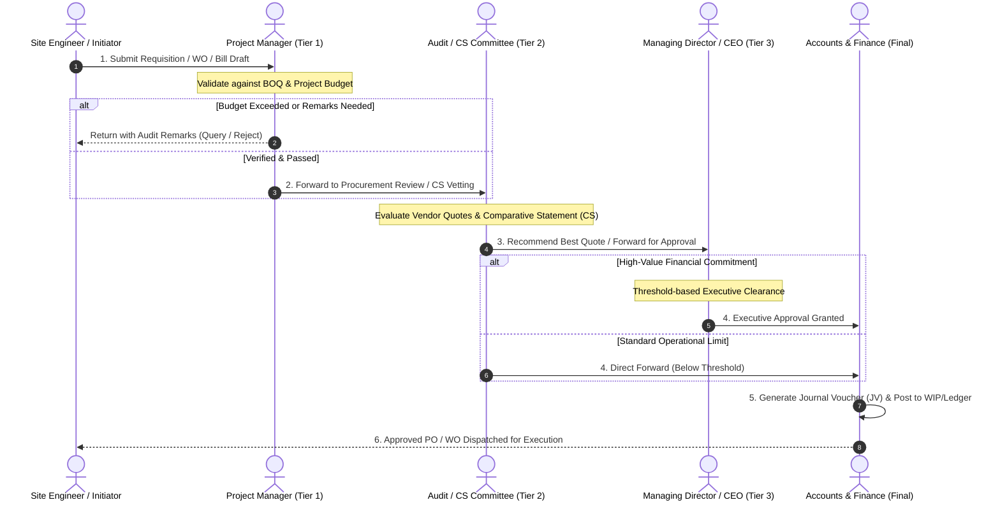

# 🏗️ Enterprise Construction MIS, Procurement Engine & Approval Workflow Platform

[](https://laravel.com)
[](https://www.php.net/)
[](https://www.mysql.com/)
[]()
[]()
[]()

> 🔒 **Confidentiality & Anonymization Notice:**  
> This repository is an anonymized technical case study and architectural deep-dive of an end-to-end enterprise Construction Management Information System (MIS), Procurement Lifecycle, and Multi-Tier Approval Platform. In compliance with commercial Non-Disclosure Agreements (NDA), proprietary client data, corporate credentials, production database seeds, and private API hostnames have been scrubbed.

---

## 📑 Table of Contents
1. [Executive Summary & Business Context](#-1-executive-summary--business-context)
2. [High-Level System Architecture](#-2-high-level-system-architecture)
3. [End-to-End Procurement & Approval State Machine](#-3-end-to-end-procurement--approval-state-machine)
4. [Core Functional Modules](#-4-core-functional-modules)
5. [AI-Powered Hybrid ERP Assistant (RAG-Lite)](#-5-ai-powered-hybrid-erp-assistant-rag-lite)
6. [Database Design, FIFO Stock Valuation & Ledger Invariants](#-6-database-design-fifo-stock-valuation--ledger-invariants)
7. [Granular Role-Based Access Control (RBAC)](#-7-granular-role-based-access-control-rbac)
8. [Key Technical Challenges & Engineered Solutions](#-8-key-technical-challenges--engineered-solutions)
9. [Tech Stack & Development Tooling](#-9-tech-stack--development-tooling)
10. [Engineering Impact & Key Metrics](#-10-engineering-impact--key-metrics)

---

## 📌 1. Executive Summary & Business Context

Large-scale real estate and civil infrastructure projects operate across dispersed construction sites, complex contractor agreements, dynamic material market rates, and multi-tier organizational hierarchies. Managing these processes through paper trails or siloed spreadsheets results in budget overruns, inventory leaks, and audit vulnerabilities.

### 🎯 Primary Objectives
* **Unified Procurement Pipeline:** Connecting Bill of Quantities (BOQ) $\to$ Material Requisitions $\to$ Vendor Comparative Statements (CS) $\to$ Purchase Orders (PO) $\to$ Goods Receive Notes (GRN) $\to$ Supplier Payment Clearances.
* **Sub-Contractor Lifecycle:** Managing Work Orders (WO), work-breakdown structures (WBS), running bills, retention money holdbacks, and advance adjustments.
* **Deterministic Approval Governance:** Enforcing strict approval matrices across project managers, audit committees, department heads, and executive leadership.
* **Financial Integrity:** Bridging real-time procurement with Work-in-Progress (WIP) accounting and general ledger postings.

---

## 🏛️ 2. High-Level System Architecture

The application is structured as a **High-Performance Modular Monolith** built on the Laravel framework, maintaining clear boundaries between domain business logic, data access layers, and dynamic presentation modules.

```mermaid
graph TB
    subgraph Client Layer
        WebUI[Web App / Blade UI]
        AjaxEngine[AJAX & Async Data Fetchers]
        AIChatWidget[Interactive AI Assistant Widget]
    end

    subgraph Security & Access Control
        AuthGuard[Multi-Tier Auth Middleware]
        RBAC[Dynamic RBAC: Menu, Resource & Link Access]
        ProjectScoping[Project/Branch Data Scoping Engine]
    end

    subgraph Domain Engine Layer
        BOQEngine[BOQ & Budget Control Engine]
        ProcurementEngine[Requisition, CS & PO Engine]
        SubContractorEngine[Work Order & Running Bill Engine]
        InventoryEngine[FIFO Inventory & Material Consumption]
        ApprovalEngine[Multi-Tier Approval State Machine]
        AccountingEngine[WIP & General Ledger Bridge]
        AIAssistantEngine[RAG-Lite Hybrid Chatbot Controller]
    end

    subgraph Persistence & Cache Layer
        MySQL[(MySQL Relational DB\nInnoDB / Transacted)]
        FileStorage[(Document & Attachment Storage)]
        RedisCache[(Manual & Schema Cache)]
    end

    ClientLayer --> Security & Access Control
    Security & Access Control --> Domain Engine Layer
    Domain Engine Layer --> Persistence & Cache Layer
```

---

## 🔄 3. End-to-End Procurement & Approval State Machine

Every material requisition, contract agreement, and financial disbursement undergoes strict multi-tier validation before reaching final execution:



---

## 📦 4. Core Functional Modules

### 1. 📐 Bill of Quantities (BOQ) & Project Budgeting
- Granular item-level rate estimation, quantity allocation, and budget caps per project.
- Real-time deviation tracking between allocated BOQ vs. cumulative purchase orders.

### 2. 📑 Comparative Statement (CS) Lifecycle
- **Material CS:** Multi-supplier quote comparison matrix evaluating unit price, payment terms, and delivery schedules.
- **Sub-contractor CS:** Task-rate comparison across specialized labour and civil contractors.
- Automated selection suggestions based on lowest compliant quotation and historical supplier rating.

### 3. 🛠️ Work Order (WO) & Sub-Contractor Management
- Work breakdown structure (WBS) tracking with milestone deliverables.
- Running bill generation with automated deductions for:
  - Mobilization advance amortization
  - Retention money (security deposit)
  - Site material damage / penalty adjustments

### 4. 📦 FIFO Material Inventory & Consumption
- Real-time stock ledgers calculating valuation using **First-In, First-Out (FIFO)** queues.
- Inter-project stock transfers with dispatch, in-transit, and receiving verification steps.
- Actual vs. theoretical material consumption reporting against structural milestones.

### 5. 💰 Financial Integration & WIP Mapping
- Automated conversion of procurement bills into standard double-entry accounting transactions.
- Auto-mapping between project **Work-in-Progress (WIP)** asset accounts and general expense accounts upon project milestone handovers.

---

## 🤖 5. AI-Powered Hybrid ERP Assistant (RAG-Lite)

To streamline operational onboarding across dozens of complex modules, the platform includes an intelligent **Hybrid AI Chatbot Assistant**:

```mermaid
flowchart TD
    UserQuery([User Enters Question in English / Bangla / Banglish]) --> Controller[ChatbotController@ask]
    Controller --> CacheLookup[Read Offline Knowledge Base 64 ERP Modules]
    CacheLookup --> FuzzyScore[Fuzzy Keyword Matching & Scoring Engine]
    
    FuzzyScore --> MatchFound{Relevant Module Identified?}
    MatchFound -->|Yes| AccessCheck{User Has Module Permission in RBAC?}
    
    AccessCheck -->|No Access| RestrictReply[Return Access Restricted Warning]
    AccessCheck -->|Authorized| LLMPrompt[Inject Context into Multi-Turn Session]
    
    MatchFound -->|No| LLMPrompt
    
    LLMPrompt --> APICall{Gemini Flash API Active?}
    APICall -->|Success| FormatMarkdown[Render Rich Markdown Response]
    APICall -->|Failure / Offline| SmartFallback[Extract Headings & Structured Manual Offline]
    
    SmartFallback --> FormatMarkdown
    RestrictReply --> FormatMarkdown
    FormatMarkdown --> Render([Output Formatted Guidance to User])
```

- **Offline-First Resilience:** Works 100% offline via structured rule extraction even when external APIs are disconnected.
- **Role-Aware Guidance:** Prevents users from querying instructions for modules they lack administrative permission to access.
- **Multilingual Understanding:** Handles natural queries in Bengali, English, and transliterated Banglish.

---

## 🗄️ 6. Database Design, FIFO Stock Valuation & Ledger Invariants

The persistence layer is engineered with **50+ relational MySQL tables** with strict transactional integrity:

```
[ Projects & Branches ]
       │ (1:N)
       ├──► [ Bill of Quantities (BOQ) ]
       │           │ (1:N)
       │           └──► [ Requisitions & Indents ]
       │                       │ (1:N)
       │                       └──► [ Comparative Statements (CS) ]
       │                                   │ (1:N)
       │                                   └──► [ Purchase Orders (PO) ]
       │                                               │ (1:N)
       │                                               ├──► [ Stock FIFO Ledger ]
       │                                               └──► [ Supplier Invoices & JV Postings ]
```

### Key Schema Invariants
- **FIFO Queue Structure (`StockFifo`):** Every incoming material batch maintains remaining available quantity and unit cost. Deductions dequeue from the oldest available batch first.
- **Atomic Balance Updates:** Account transactions (`EwAccountTransaction`) require strict debit/credit parity before committing.
- **Append-Only Audit Trails:** Log tables (`RequisitionApprovalLog`, `WorkOrderApprovalLog`, `BillApprovalHistory`) maintain unmodifiable historical states with timestamps, previous statuses, and reviewer IDs.

---

## 🛡️ 7. Granular Role-Based Access Control (RBAC)

The security model operates on a 3-dimensional authorization matrix:
1. **Organizational Scope:** User is restricted to specific branch areas and projects assigned via `CtProjectUserAssignment`.
2. **Module & Menu Access:** Dynamic routing middleware (`adminAccess`, `projectAccess`) evaluates user roles against navigation trees (`SoftwareModules`, `SoftwareMenu`).
3. **Action & Endpoint Permissions:** Internal link verification prevents direct API tampering or unauthorized form submissions.

---

## 💡 8. Key Technical Challenges & Engineered Solutions

| # | Challenge | Technical Root Cause | Engineered Solution |
|---|---|---|---|
| **1** | **Dynamic Multi-Level Approval Hierarchies** | Different projects required dynamic combinations of checkers, reviewers, and approvers depending on financial ceilings. | Designed a **configurable state engine** decoupling workflow routing from business transaction tables. Status changes trigger event-driven state transitions with historical logging. |
| **2** | **N+1 Performance Bottlenecks in Complex Ledgers** | Deeply nested relationships (Project $\to$ PO $\to$ GRN $\to$ Invoices $\to$ Payments) caused severe query latency on dashboard reports. | Implemented **Eager Loading (`with()`)**, indexed composite foreign keys, and pre-aggregated ledger summary views, slashing page load times by **~65%**. |
| **3** | **Concurrent Approval Collisions** | Simultaneous approval actions by different committee members caused duplicate ledger postings or invalid state transitions. | Utilized database-level **Pessimistic Locking (`lockForUpdate`)** inside wrapped `DB::transaction()` blocks to enforce deterministic serialized execution. |
| **4** | **FIFO Stock Valuation Accuracy Across Job Sites** | Material prices fluctuated across shipments; simple average costing led to skewed project cost accounting. | Built an automated **FIFO lot-tracking engine** that consumes stock batches strictly by date and purchase unit rate, calculating exact real-time valuation. |

---

## 💻 9. Tech Stack & Development Tooling

- **Backend Framework:** PHP 7.4 / 8.x, Laravel Framework
- **Database Engine:** MySQL 8.x (InnoDB, Foreign Key Constraints, Normalized Indexes)
- **Frontend Architecture:** Blade Templates, JavaScript (ES6+), jQuery, AJAX, Bootstrap 4/5, Custom CSS
- **AI / NLP Services:** Google Gemini Flash API + Custom Retrieval-Augmented Keyword Matching Engine
- **DevOps & Tooling:** Composer, Webpack Mix, Artisan CLI, Git, Postman

---

## 📊 10. Engineering Impact & Key Metrics

* 🚀 **Eliminated 100% of Physical Paperwork** across procurement, work orders, and billing workflows.
* ⚡ **Cut Procurement Cycle Time by 75%** through instant automated forwarding across approval tiers.
* 🛡️ **Zero Duplicate or Unverified Payments** via automated advance deduction checks and three-way matching (PO vs. GRN vs. Invoice).
* 📈 **Precise Real-time Project Costing** enabled by continuous FIFO stock valuation and WIP account mapping.

---

<p align="center">
  <b>Developed & Architected by Shakhawat Sakib</b><br>
  <i>Full-Stack & Backend Software Engineer</i>
</p>
